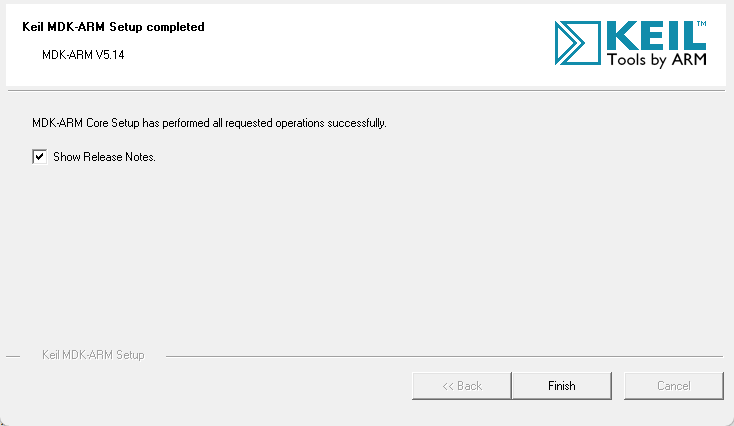
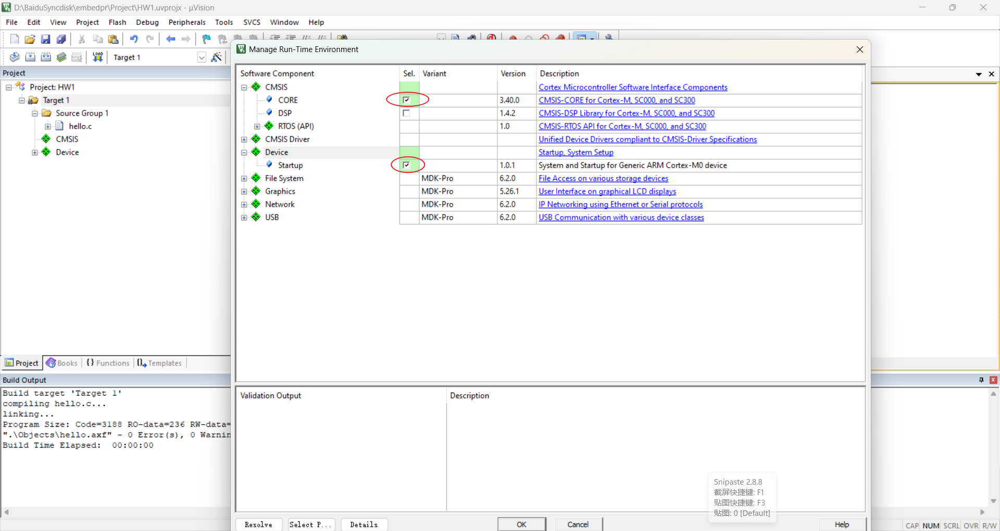
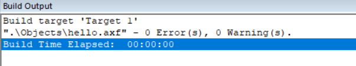
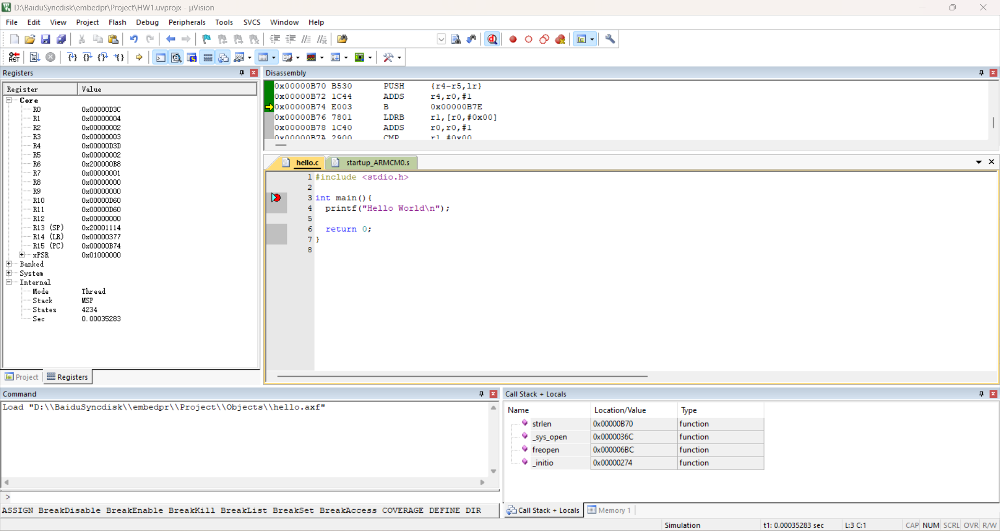
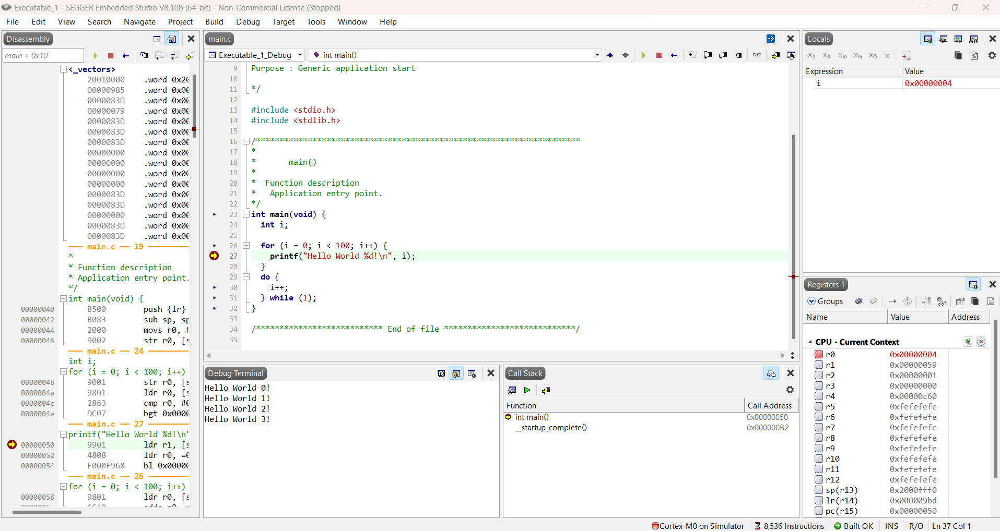
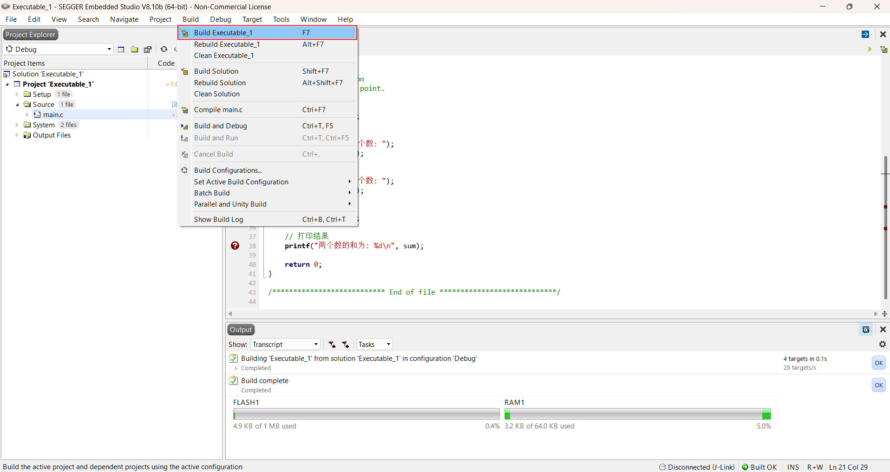
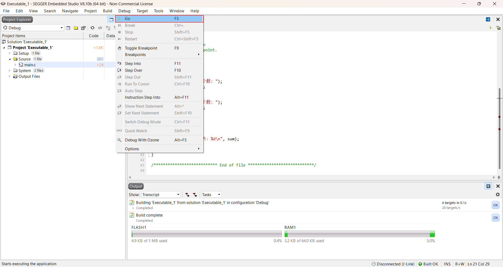
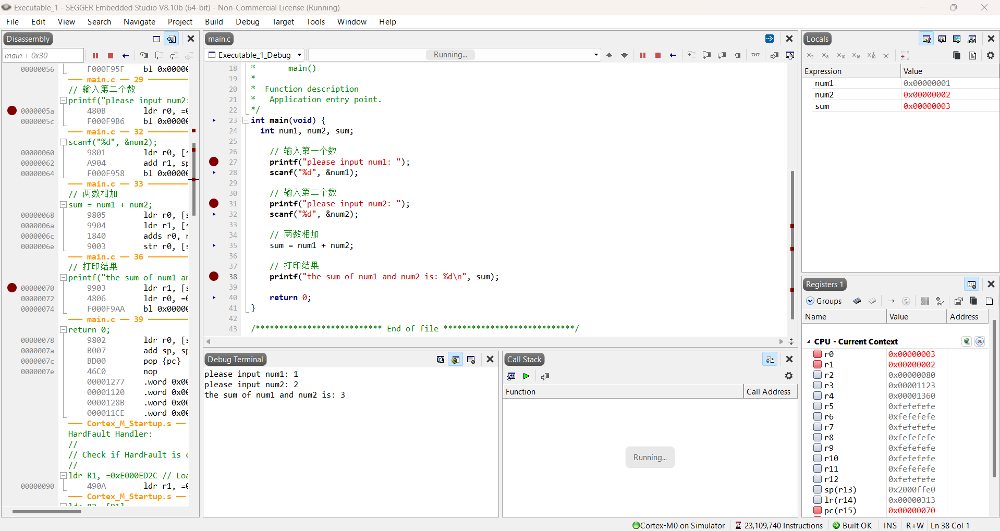

# HW1

# 使用Keil

## 1. 安装Keil

> https://blog.csdn.net/lemou1211/article/details/128907850

根据该博客内容安装并破解Keil



## 2. 调试并运行程序

报错

```shell
.\Objects\hello.sct(7): error: L6236E: No section matches selector - no section to be FIRST/LAST. Not enough information to list image symbols. Not enough information to list the image map. Finished: 2 information, 0 warning and 1 error messages. ".\Objects\hello.axf" - 1 Error(s), 1 Warning(s). Target not created. Build Time Elapsed:  00:00:00
```

> https://www.cnblogs.com/forever-youth/p/15866152.html

引用该文章解决




编译成功




Debug



# 使用Segger

## 1. 安装Segger

在官网下载并安装

> https://www.segger.com/

## 2. 调试并运行hello程序

调试并运行hello world程序

```c
/*********************************************************************
*                    SEGGER Microcontroller GmbH                     *
*                        The Embedded Experts                        *
**********************************************************************

-------------------------- END-OF-HEADER -----------------------------

File    : main.c
Purpose : Generic application start

*/

#include <stdio.h>
#include <stdlib.h>

/*********************************************************************
*
*       main()
*
*  Function description
*   Application entry point.
*/
int main(void) {
  int i;

  for (i = 0; i < 100; i++) {
    printf("Hello World %d!\n", i);
  }
  do {
    i++;
  } while (1);
}

/*************************** End of file ****************************/
```





## 3. 调试并运行两数相加

```C
int main(void) {
  int num1, num2, sum;

    // 输入第一个数
    printf("please input num1: ");
    scanf("%d", &num1);

    // 输入第二个数
    printf("please input num2: ");
    scanf("%d", &num2);

    // 两数相加
    sum = num1 + num2;

    // 打印结果
    printf("the sum of num1 and num2 is: %d\n", sum);

    return 0;
}
```


首先编译




然后Debug




输入两个数1和2，得到两数之和3



可以在Debug界面单步运行并查看内部寄存器，变量值等内容

下方有Debug Terminal和函数调用等

左方为汇编指令