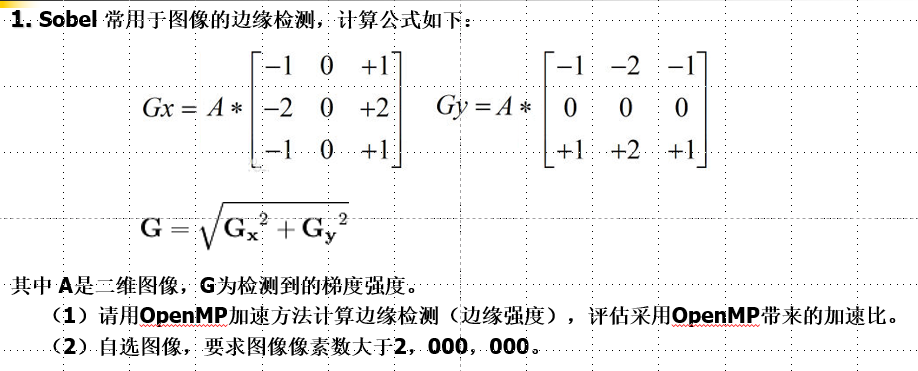
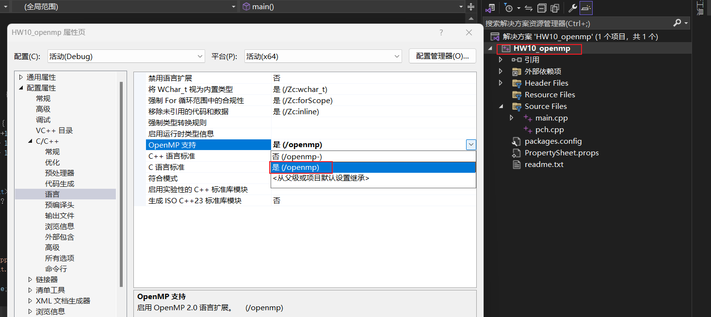
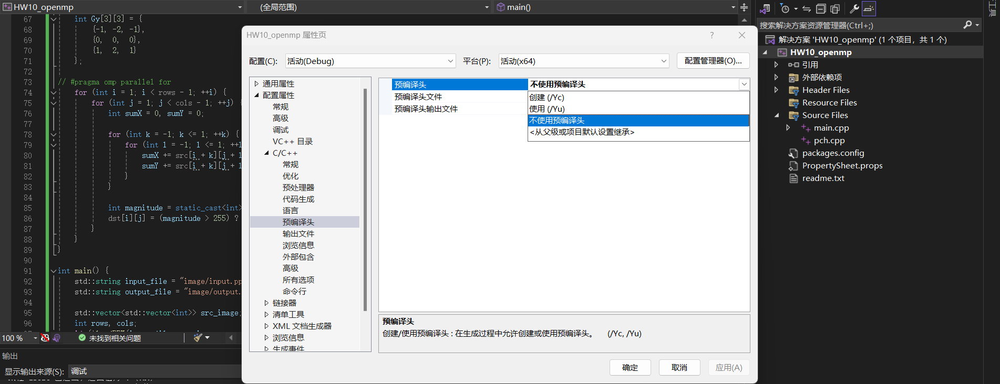
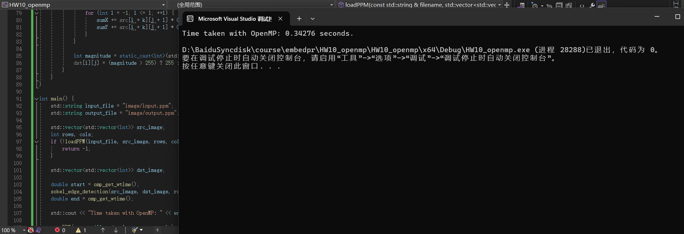
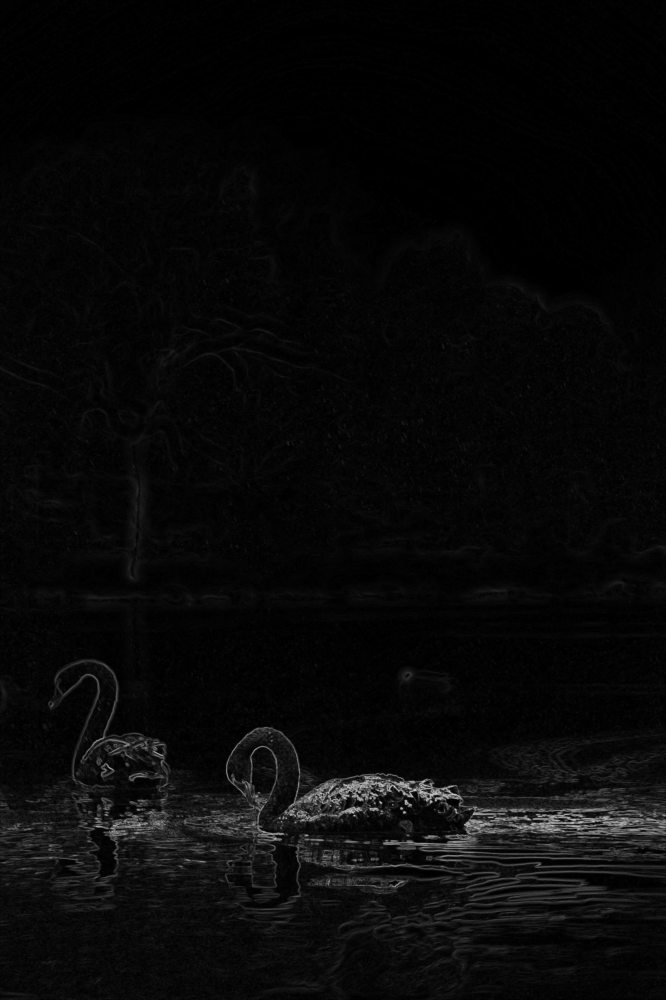
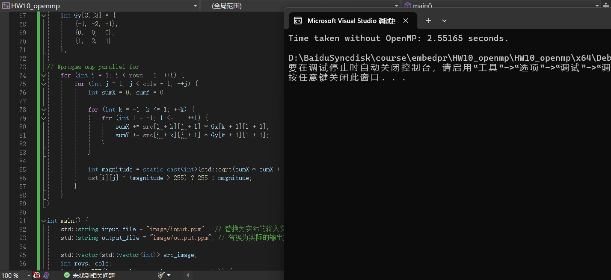

[TOC]

# HW10_OpenMP

Sobel 常用于图像的边缘检测:

 （1）请用OpenMP加速方法计算边缘检测（边缘强度），评估采用OpenMP带来的加速比。

 （2）自选图像，要求图像像素数大于2，000，000。




## 1. 图片预处理

为了方便C++程序处理图片，使用python将jpg/png格式的图片处理为P3格式的图片。

P3格式是PPM（Portable Pixmap）格式的一种，它是Netpbm格式家族的一部分。PPM文件是一种简单的图像格式，用于存储像素图（bitmap）。

```
P3
# 宽度 高度
宽度 高度
最大颜色值
像素数据（R G B R G B ...）
```

### 1.1 转换代码

``` python
from PIL import Image

def convert_jpg_to_ppm(input_file, output_file):
    # 打开JPG文件
    img = Image.open(input_file)
    
    # 将图像转换为RGB格式
    img = img.convert("RGB")
    
    # 获取图像尺寸
    width, height = img.size
    
    # 获取像素数据
    pixels = img.load()
    
    # 打开输出文件
    with open(output_file, 'w') as f:
        # 写入PPM文件头
        f.write("P3\n")
        f.write(f"{width} {height}\n")
        f.write("255\n")
        
        # 写入像素数据
        for y in range(height):
            for x in range(width):
                r, g, b = pixels[x, y]
                f.write(f"{r} {g} {b} ")
            f.write("\n")


def convert_ppm_to_jpg(input_file, output_file):
    # 打开PPM文件
    img = Image.open(input_file)
    
    # 保存为JPG格式
    img.save(output_file, 'JPEG')

# 示例使用
convert_jpg_to_ppm("input.jpg", "input.ppm")
# convert_ppm_to_jpg('output.ppm', 'output_without.jpg')


```

### 1.2 输入图片

选择一张图片作为输入:


### 1.3 图像转换

转换完成后输出input.ppm。图像大小为`3589 * 5384 = 19,323,176 > 2,000,000`

```
P3
3589 5384
255
171 180 221 171 180 221 171 180 221 170 179 220 170 179 220 170 179 220 169 178 219 169 178 219 171 180 221 171 180 221 171 180 221 170 179 220 170 179 220 170 179 220 169 178 219 169 178 219 169 178 219 169 178 219 169 178 219 169 178 219 170 179 220 170 179 220 170 179 ……
……
```


## 2. 使用sobel算子进行边缘检测

Sobel算子是一种经典的边缘检测算法，用于识别图像中的边缘。它结合了图像的平滑和微分操作，可以有效地在图像中检测出梯度变化显著的区域。

Sobel算子的边缘检测过程主要包括以下步骤：

1. 计算图像在水平方向和垂直方向上的梯度。
2. 计算梯度幅值和方向。
3. 对梯度幅值进行阈值化，提取边缘。
4. （可选）进行非极大值抑制，进一步精确边缘位置。

Sobel算子由于其简单和有效性，广泛应用于图像处理和计算机视觉领域。


### 2.1 环境配置

使用Visual Studio，也可使用在编译时使用  `gcc -fopenmp your_program.c -o your_program`支持OpenMP。


在Visual Studio中创建新工程，右键项目属性 -> C/C++

- 选择支持OpenMP




- 选择不使用预编译头




### 2.2 代码实现

```cpp
#include <iostream>
#include <fstream>
#include <vector>
#include <cmath>
#include <omp.h>

// Function to load PPM image
bool loadPPM(const std::string& filename, std::vector<std::vector<int>>& image, int& rows, int& cols) {
    std::ifstream file(filename);
    if (!file.is_open()) {
        std::cerr << "Error: Could not open the file!" << std::endl;
        return false;
    }

    std::string format;
    file >> format;
    if (format != "P3") {
        std::cerr << "Error: Only P3 format is supported!" << std::endl;
        return false;
    }

    file >> cols >> rows;
    int max_val;
    file >> max_val;

    image.resize(rows, std::vector<int>(cols));

    for (int i = 0; i < rows; ++i) {
        for (int j = 0; j < cols; ++j) {
            int r, g, b;
            file >> r >> g >> b;
            image[i][j] = (r + g + b) / 3; // Convert to grayscale
        }
    }

    file.close();
    return true;
}

// Function to save PPM image
void savePPM(const std::string& filename, const std::vector<std::vector<int>>& image, int rows, int cols) {
    std::ofstream file(filename);
    if (!file.is_open()) {
        std::cerr << "Error: Could not open the file for writing!" << std::endl;
        return;
    }
    file << "P3\n" << cols << " " << rows << "\n255\n";
    for (int i = 0; i < rows; ++i) {
        for (int j = 0; j < cols; ++j) {
            int val = image[i][j];
            file << val << " " << val << " " << val << "\n";
        }
    }
    file.close();
}

// Function to perform Sobel edge detection
void sobel_edge_detection(const std::vector<std::vector<int>>& src, std::vector<std::vector<int>>& dst, int rows, int cols) {
    dst.resize(rows, std::vector<int>(cols, 0));

    int Gx[3][3] = {
        {-1, 0, 1},
        {-2, 0, 2},
        {-1, 0, 1}
    };

    int Gy[3][3] = {
        {-1, -2, -1},
        {0,  0,  0},
        {1,  2,  1}
    };

#pragma omp parallel for
    for (int i = 1; i < rows - 1; ++i) {
        for (int j = 1; j < cols - 1; ++j) {
            int sumX = 0, sumY = 0;

            for (int k = -1; k <= 1; ++k) {
                for (int l = -1; l <= 1; ++l) {
                    sumX += src[i + k][j + l] * Gx[k + 1][l + 1];
                    sumY += src[i + k][j + l] * Gy[k + 1][l + 1];
                }
            }

            int magnitude = static_cast<int>(std::sqrt(sumX * sumX + sumY * sumY));
            dst[i][j] = (magnitude > 255) ? 255 : magnitude;
        }
    }
}

int main() {
    std::string input_file = "image/input.ppm";  // 替换为实际的输入文件路径
    std::string output_file = "image/output.ppm"; // 替换为实际的输出文件路径

    std::vector<std::vector<int>> src_image;
    int rows, cols;
    if (!loadPPM(input_file, src_image, rows, cols)) {
        return -1;
    }

    std::vector<std::vector<int>> dst_image;

    double start = omp_get_wtime();
    sobel_edge_detection(src_image, dst_image, rows, cols);
    double end = omp_get_wtime();

    std::cout << "Time taken with OpenMP: " << end - start << " seconds." << std::endl;
    //std::cout << "Time taken without OpenMP: " << end - start << " seconds." << std::endl;

    savePPM(output_file, dst_image, rows, cols);

    return 0;
}

```


### 2.3 转换结果

#### 使用 OpenMP

- 使用OpenMP进行加速，计算得到结果如下，计算用时`0.34276s`




- 将输出的P3格式图片转换回jpg格式结果如下



#### 不使用 OpenMP

- 不使用OpenMP进行加速，计算得到结果如下，计算用时`2.55165s`




- 将输出的P3格式图片转换回jpg格式结果如下


## 3. 结果分析


| 是否使用OpenMP | 耗时(s) |
| -------------- | ------- |
| yes            | 0.34276 |
| no             | 2.55165 |


$Speedup = Time\_serial / Time\_parallel = 2.55165 / 0.34276 = 7.44 $ 


也可使用更高的并行策略提高加速比。