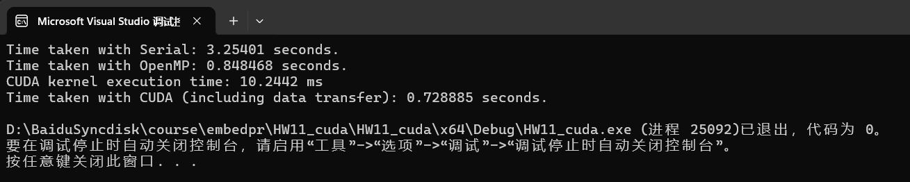
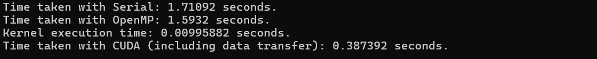
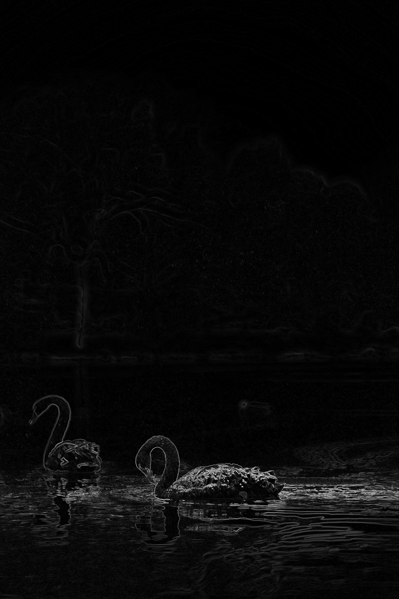

# HW11——CUDA

 用 GPU 实现 Sobel 算子，并用于提取图像边缘，并与OpenMP比较计算时间。


[TOC]

## 1、CUDA环境安装

查看电脑支持的cuda版本，根据教程安装CUDA和cuDNN。安装过程如下：

https://github.com/huangxc6/tutorial/tree/main/CUDA


## 2、读取PPM格式的图片

### 2.1 代码

main.cpp

``` C++
#include <iostream>
#include <fstream>
#include <vector>
#include <cmath>
#include <omp.h>

// Function to load PPM image
bool loadPPM(const std::string& filename, std::vector<std::vector<int>>& image, int& rows, int& cols) {
    std::ifstream file(filename);
    if (!file.is_open()) {
        std::cerr << "Error: Could not open the file!" << std::endl;
        return false;
    }

    std::string format;
    file >> format;
    if (format != "P3") {
        std::cerr << "Error: Only P3 format is supported!" << std::endl;
        return false;
    }

    file >> cols >> rows;
    int max_val;
    file >> max_val;

    image.resize(rows, std::vector<int>(cols));

    for (int i = 0; i < rows; ++i) {
        for (int j = 0; j < cols; ++j) {
            int r, g, b;
            file >> r >> g >> b;
            image[i][j] = (r + g + b) / 3; // Convert to grayscale
        }
    }

    file.close();
    return true;
}

// Function to save PPM image
void savePPM(const std::string& filename, const std::vector<std::vector<int>>& image, int rows, int cols) {
    std::ofstream file(filename);
    if (!file.is_open()) {
        std::cerr << "Error: Could not open the file for writing!" << std::endl;
        return;
    }
    file << "P3\n" << cols << " " << rows << "\n255\n";
    for (int i = 0; i < rows; ++i) {
        for (int j = 0; j < cols; ++j) {
            int val = image[i][j];
            file << val << " " << val << " " << val << "\n";
        }
    }
    file.close();
}

// Function to perform serial Sobel edge detection
void sobel_edge_detection_serial(const std::vector<std::vector<int>>& src, std::vector<std::vector<int>>& dst, int rows, int cols) {
    dst.resize(rows, std::vector<int>(cols, 0));

    int Gx[3][3] = {
        {-1, 0, 1},
        {-2, 0, 2},
        {-1, 0, 1}
    };

    int Gy[3][3] = {
        {-1, -2, -1},
        {0,  0,  0},
        {1,  2,  1}
    };

    for (int i = 1; i < rows - 1; ++i) {
        for (int j = 1; j < cols - 1; ++j) {
            int sumX = 0, sumY = 0;

            for (int k = -1; k <= 1; ++k) {
                for (int l = -1; l <= 1; ++l) {
                    sumX += src[i + k][j + l] * Gx[k + 1][l + 1];
                    sumY += src[i + k][j + l] * Gy[k + 1][l + 1];
                }
            }

            int magnitude = static_cast<int>(std::sqrt(sumX * sumX + sumY * sumY));
            dst[i][j] = (magnitude > 255) ? 255 : magnitude;
        }
    }
}

// Function to perform OpenMP Sobel edge detection
void sobel_edge_detection_openmp(const std::vector<std::vector<int>>& src, std::vector<std::vector<int>>& dst, int rows, int cols) {
    dst.resize(rows, std::vector<int>(cols, 0));

    int Gx[3][3] = {
        {-1, 0, 1},
        {-2, 0, 2},
        {-1, 0, 1}
    };

    int Gy[3][3] = {
        {-1, -2, -1},
        {0,  0,  0},
        {1,  2,  1}
    };

#pragma omp parallel for
    for (int i = 1; i < rows - 1; ++i) {
        for (int j = 1; j < cols - 1; ++j) {
            int sumX = 0, sumY = 0;

            for (int k = -1; k <= 1; ++k) {
                for (int l = -1; l <= 1; ++l) {
                    sumX += src[i + k][j + l] * Gx[k + 1][l + 1];
                    sumY += src[i + k][j + l] * Gy[k + 1][l + 1];
                }
            }

            int magnitude = static_cast<int>(std::sqrt(sumX * sumX + sumY * sumY));
            dst[i][j] = (magnitude > 255) ? 255 : magnitude;
        }
    }
}

// CUDA wrapper function declaration
extern "C" void sobel_edge_detection_cuda_wrapper(const std::vector<std::vector<int>>&src, std::vector<std::vector<int>>&dst, int rows, int cols);

int main() {
    std::string input_file = "image/input.ppm";  // 替换为实际的输入文件路径
    std::string output_file_serial = "image/output_serial.ppm"; // 替换为实际的输出文件路径
    std::string output_file_openmp = "image/output_openmp.ppm"; // 替换为实际的输出文件路径
    std::string output_file_cuda = "image/output_cuda.ppm"; // 替换为实际的输出文件路径

    std::vector<std::vector<int>> src_image;
    int rows, cols;
    if (!loadPPM(input_file, src_image, rows, cols)) {
        return -1;
    }

    std::vector<std::vector<int>> dst_image_serial;
    std::vector<std::vector<int>> dst_image_openmp;
    std::vector<std::vector<int>> dst_image_cuda;

    // Serial execution
    double start_serial = omp_get_wtime();
    sobel_edge_detection_serial(src_image, dst_image_serial, rows, cols);
    double end_serial = omp_get_wtime();
    std::cout << "Time taken with Serial: " << end_serial - start_serial << " seconds." << std::endl;

    // savePPM(output_file_serial, dst_image_serial, rows, cols);

    // OpenMP execution
    double start_openmp = omp_get_wtime();
    sobel_edge_detection_openmp(src_image, dst_image_openmp, rows, cols);
    double end_openmp = omp_get_wtime();
    std::cout << "Time taken with OpenMP: " << end_openmp - start_openmp << " seconds." << std::endl;

    // savePPM(output_file_openmp, dst_image_openmp, rows, cols);

    // CUDA execution
    double start_cuda = omp_get_wtime();
    sobel_edge_detection_cuda_wrapper(src_image, dst_image_cuda, rows, cols);
    double end_cuda = omp_get_wtime();
    std::cout << "Time taken with CUDA (including data transfer): " << end_cuda - start_cuda << " seconds." << std::endl;

    // savePPM(output_file_cuda, dst_image_cuda, rows, cols);

    return 0;
}

```


sobel.cu

``` C++
#include <cuda_runtime.h>
#include <vector>
#include <cmath>
#include <iostream>

__global__ void sobel_edge_detection_cuda(const int* src, int* dst, int rows, int cols) {
    int Gx[3][3] = {
        {-1, 0, 1},
        {-2, 0, 2},
        {-1, 0, 1}
    };

    int Gy[3][3] = {
        {-1, -2, -1},
        {0,  0,  0},
        {1,  2,  1}
    };

    int x = blockIdx.x * blockDim.x + threadIdx.x;
    int y = blockIdx.y * blockDim.y + threadIdx.y;

    if (x > 0 && x < cols - 1 && y > 0 && y < rows - 1) {
        int sumX = 0, sumY = 0;

        for (int k = -1; k <= 1; ++k) {
            for (int l = -1; l <= 1; ++l) {
                int pixel = src[(y + k) * cols + (x + l)];
                sumX += pixel * Gx[k + 1][l + 1];
                sumY += pixel * Gy[k + 1][l + 1];
            }
        }

        int magnitude = static_cast<int>(sqrtf(sumX * sumX + sumY * sumY));
        dst[y * cols + x] = (magnitude > 255) ? 255 : magnitude;
    }
}

extern "C" void sobel_edge_detection_cuda_wrapper(const std::vector<std::vector<int>>&src, std::vector<std::vector<int>>&dst, int rows, int cols) {
    int* d_src;
    int* d_dst;
    size_t size = rows * cols * sizeof(int);

    std::vector<int> flat_src(rows * cols);
    std::vector<int> flat_dst(rows * cols);

    for (int i = 0; i < rows; ++i)
        for (int j = 0; j < cols; ++j)
            flat_src[i * cols + j] = src[i][j];

    cudaMalloc((void**)&d_src, size);
    cudaMalloc((void**)&d_dst, size);

    cudaMemcpy(d_src, flat_src.data(), size, cudaMemcpyHostToDevice);

    dim3 threadsPerBlock(16, 16);
    dim3 numBlocks((cols + threadsPerBlock.x - 1) / threadsPerBlock.x, (rows + threadsPerBlock.y - 1) / threadsPerBlock.y);

    cudaEvent_t start, stop;
    cudaEventCreate(&start);
    cudaEventCreate(&stop);

    cudaEventRecord(start);
    sobel_edge_detection_cuda << <numBlocks, threadsPerBlock >> > (d_src, d_dst, rows, cols);
    cudaEventRecord(stop);

    cudaEventSynchronize(stop);

    float milliseconds = 0;
    cudaEventElapsedTime(&milliseconds, start, stop);

    std::cout << "CUDA kernel execution time: " << milliseconds << " ms" << std::endl;

    cudaMemcpy(flat_dst.data(), d_dst, size, cudaMemcpyDeviceToHost);

    cudaFree(d_src);
    cudaFree(d_dst);

    dst.resize(rows, std::vector<int>(cols));
    for (int i = 0; i < rows; ++i)
        for (int j = 0; j < cols; ++j)
            dst[i][j] = flat_dst[i * cols + j];
}

```


### 2.2 结果分析

运行结果对比如下：




| 运行类型 | 耗时(s)  |
| -------- | -------- |
| serial   | 3.25401  |
| openMP   | 0.848468 |
| CUDA     | 0.728885 |


发现使用CUDA相比openMP速度并没有显著提升，但都显著优于串行程序。

但CUDA kernel的执行时间仅为`10.2442ms`，整个循环运行速度非常快，但图片数据过大，`cudaMemcpy`占用了大量的时间，由此导致速度的下降。

## 3、使用opencv读取图片

参考 [OpenCV在visual studio 2022中的下载与配置](https://blog.csdn.net/ycx_ccc/article/details/123258001) 安装opencv并在visual studio中做相应的配置


### 3.1 代码

代码如下：

``` c++
#include <iostream>
#include <vector>
#include <cmath>
#include <omp.h>
#include <opencv2/opencv.hpp>
#include <cuda_runtime.h>

using namespace cv;

__global__ void sobel_kernel(int* src, int* dst, int rows, int cols) {
    int x = blockIdx.x * blockDim.x + threadIdx.x;
    int y = blockIdx.y * blockDim.y + threadIdx.y;

    if (x > 0 && x < cols - 1 && y > 0 && y < rows - 1) {
        int Gx[3][3] = {
            {-1, 0, 1},
            {-2, 0, 2},
            {-1, 0, 1}
        };

        int Gy[3][3] = {
            {-1, -2, -1},
            {0,  0,  0},
            {1,  2,  1}
        };

        int sumX = 0, sumY = 0;

        for (int i = -1; i <= 1; ++i) {
            for (int j = -1; j <= 1; ++j) {
                int pixel = src[(y + i) * cols + (x + j)];
                sumX += pixel * Gx[i + 1][j + 1];
                sumY += pixel * Gy[i + 1][j + 1];
            }
        }

        int magnitude = static_cast<int>(sqrtf(sumX * sumX + sumY * sumY));
        dst[y * cols + x] = (magnitude > 255) ? 255 : magnitude;
    }
}

// Function to perform serial Sobel edge detection
void sobel_edge_detection_serial(const std::vector<std::vector<int>>& src, std::vector<std::vector<int>>& dst, int rows, int cols) {
    dst.resize(rows, std::vector<int>(cols, 0));

    int Gx[3][3] = {
        {-1, 0, 1},
        {-2, 0, 2},
        {-1, 0, 1}
    };

    int Gy[3][3] = {
        {-1, -2, -1},
        {0,  0,  0},
        {1,  2,  1}
    };

    for (int i = 1; i < rows - 1; ++i) {
        for (int j = 1; j < cols - 1; ++j) {
            int sumX = 0, sumY = 0;

            for (int k = -1; k <= 1; ++k) {
                for (int l = -1; l <= 1; ++l) {
                    sumX += src[i + k][j + l] * Gx[k + 1][l + 1];
                    sumY += src[i + k][j + l] * Gy[k + 1][l + 1];
                }
            }

            int magnitude = static_cast<int>(std::sqrt(sumX * sumX + sumY * sumY));
            dst[i][j] = (magnitude > 255) ? 255 : magnitude;
        }
    }
}

// Function to perform OpenMP Sobel edge detection
void sobel_edge_detection_openmp(const std::vector<std::vector<int>>& src, std::vector<std::vector<int>>& dst, int rows, int cols) {
    dst.resize(rows, std::vector<int>(cols, 0));

    int Gx[3][3] = {
        {-1, 0, 1},
        {-2, 0, 2},
        {-1, 0, 1}
    };

    int Gy[3][3] = {
        {-1, -2, -1},
        {0,  0,  0},
        {1,  2,  1}
    };

#pragma omp parallel for
    for (int i = 1; i < rows - 1; ++i) {
        for (int j = 1; j < cols - 1; ++j) {
            int sumX = 0, sumY = 0;

            for (int k = -1; k <= 1; ++k) {
                for (int l = -1; l <= 1; ++l) {
                    sumX += src[i + k][j + l] * Gx[k + 1][l + 1];
                    sumY += src[i + k][j + l] * Gy[k + 1][l + 1];
                }
            }

            int magnitude = static_cast<int>(std::sqrt(sumX * sumX + sumY * sumY));
            dst[i][j] = (magnitude > 255) ? 255 : magnitude;
        }
    }
}

void sobel_edge_detection_cuda_wrapper(const std::vector<std::vector<int>>& src, std::vector<std::vector<int>>& dst, int rows, int cols) {
    int* d_src;
    int* d_dst;

    size_t size = rows * cols * sizeof(int);

    std::vector<int> src_flat(rows * cols);
    std::vector<int> dst_flat(rows * cols);

    for (int i = 0; i < rows; ++i)
        for (int j = 0; j < cols; ++j)
            src_flat[i * cols + j] = src[i][j];

    cudaMalloc(&d_src, size);
    cudaMalloc(&d_dst, size);

    cudaMemcpy(d_src, src_flat.data(), size, cudaMemcpyHostToDevice);

    dim3 blockSize(16, 16);
    dim3 gridSize((cols + blockSize.x - 1) / blockSize.x, (rows + blockSize.y - 1) / blockSize.y);

    cudaEvent_t start, stop;
    cudaEventCreate(&start);
    cudaEventCreate(&stop);

    cudaEventRecord(start);
    sobel_kernel << <gridSize, blockSize >> > (d_src, d_dst, rows, cols);
    cudaEventRecord(stop);

    cudaMemcpy(dst_flat.data(), d_dst, size, cudaMemcpyDeviceToHost);

    cudaEventSynchronize(stop);

    float milliseconds = 0;
    cudaEventElapsedTime(&milliseconds, start, stop);

    std::cout << "Kernel execution time: " << milliseconds / 1000.0 << " seconds." << std::endl;

    dst.resize(rows, std::vector<int>(cols));
    for (int i = 0; i < rows; ++i)
        for (int j = 0; j < cols; ++j)
            dst[i][j] = dst_flat[i * cols + j];

    cudaFree(d_src);
    cudaFree(d_dst);
}

int main() {
    std::string input_file = "image/input.jpg";  // 替换为实际的输入文件路径
    std::string output_file_serial = "image/output_serial.jpg"; // 替换为实际的输出文件路径
    std::string output_file_openmp = "image/output_openmp.jpg"; // 替换为实际的输出文件路径
    std::string output_file_cuda = "image/output_cuda.jpg"; // 替换为实际的输出文件路径

    // Use OpenCV to read the image
    Mat image = imread(input_file, IMREAD_COLOR);
    if (image.empty()) {
        std::cerr << "Error: Could not open or find the image!" << std::endl;
        return -1;
    }

    // Convert to grayscale
    Mat gray_image;
    cvtColor(image, gray_image, COLOR_BGR2GRAY);

    int rows = gray_image.rows;
    int cols = gray_image.cols;
    std::vector<std::vector<int>> src_image(rows, std::vector<int>(cols));
    for (int i = 0; i < rows; ++i)
        for (int j = 0; j < cols; ++j)
            src_image[i][j] = gray_image.at<uchar>(i, j);

    std::vector<std::vector<int>> dst_image_serial;
    std::vector<std::vector<int>> dst_image_openmp;
    std::vector<std::vector<int>> dst_image_cuda;

    // Serial execution
    double start_serial = omp_get_wtime();
    sobel_edge_detection_serial(src_image, dst_image_serial, rows, cols);
    double end_serial = omp_get_wtime();
    std::cout << "Time taken with Serial: " << end_serial - start_serial << " seconds." << std::endl;

    // Save the serial result
    Mat output_serial(rows, cols, CV_8UC1);
    for (int i = 0; i < rows; ++i)
        for (int j = 0; j < cols; ++j)
            output_serial.at<uchar>(i, j) = dst_image_serial[i][j];
    imwrite(output_file_serial, output_serial);

    // OpenMP execution
    double start_openmp = omp_get_wtime();
    sobel_edge_detection_openmp(src_image, dst_image_openmp, rows, cols);
    double end_openmp = omp_get_wtime();
    std::cout << "Time taken with OpenMP: " << end_openmp - start_openmp << " seconds." << std::endl;

    // Save the OpenMP result
    Mat output_openmp(rows, cols, CV_8UC1);
    for (int i = 0; i < rows; ++i)
        for (int j = 0; j < cols; ++j)
            output_openmp.at<uchar>(i, j) = dst_image_openmp[i][j];
    imwrite(output_file_openmp, output_openmp);

    // CUDA execution
    double start_cuda = omp_get_wtime();
    sobel_edge_detection_cuda_wrapper(src_image, dst_image_cuda, rows, cols);
    double end_cuda = omp_get_wtime();
    std::cout << "Time taken with CUDA (including data transfer): " << end_cuda - start_cuda << " seconds." << std::endl;

    // Save the CUDA result
    Mat output_cuda(rows, cols, CV_8UC1);
    for (int i = 0; i < rows; ++i)
        for (int j = 0; j < cols; ++j)
            output_cuda.at<uchar>(i, j) = dst_image_cuda[i][j];
    imwrite(output_file_cuda, output_cuda);

    return 0;
}

```


### 3.2 结果分析




该情况下openMP与Serial相比无显著提升，但CUDA有明显提升。

| 运行类型 | 耗时(s)  |
| -------- | -------- |
| serial   | 1.71092  |
| openMP   | 1.5932   |
| CUDA     | 0.387392 |


$ Speedup = Time\_openmp / Time\_cuda = 1.5932 / 0.387392 = 4.11 $ 


input:


Serial:




openMP:


cuda:


