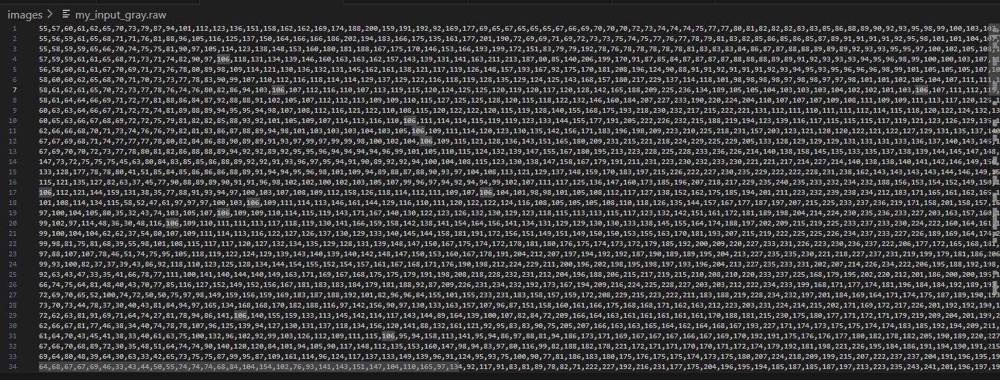
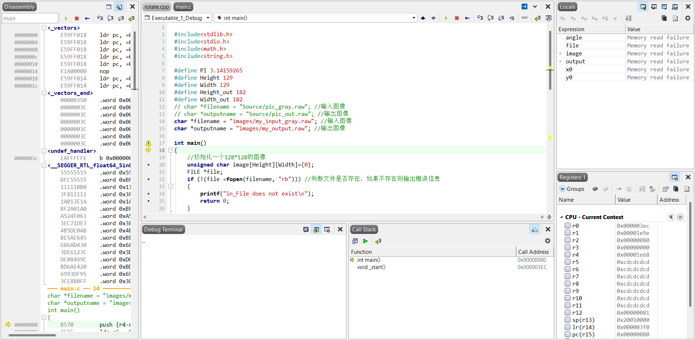
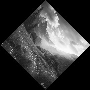

# 导入一幅128X128的8bit灰度图像，请在ARM 处理器上编程，使图像顺时针旋转45度，并导出图像

1. 图像预处理

   - 使用opencv加载原始图像。
   - 将图像缩放为128x128像素大小。

2. ARM处理器代码编写并运行

   - 在Segger中创建一个新工程，并导入预处理后的图像数据。
   - 编写ARM处理器代码以实现图像的顺时针旋转45度操作。

   - 在Segger仿真环境中运行ARM处理器代码，对图像进行旋转处理。
   - 导出旋转后的图像数据文件，以备后续Python处理使用。

3. 图像还原

   - 将在Segger中处理后导出的图像数据加载到Python中。
   - 对还原后的图像进行保存或显示，验证旋转处理的准确性。
   
   

## 1. 图像预处理

### 1.1 代码

```python
## 读取图片
def turn_img(path):
    img = cv2.imread(path, 1)
    ## 转换为灰度图，比特数为8
    gray = cv2.cvtColor(img, cv2.COLOR_BGR2GRAY)
    ## 转换大小，128*128
    resized = cv2.resize(gray, (128, 128))
    # 保存图片
    cv2.imwrite('images/my_input_gray.jpg', resized)
    # 保存为.raw格式,方便后续读取
    np.savetxt('images/my_input_gray.raw', resized, delimiter=',', fmt='%d')
    print('Read and convert done!')
```


### 1.2 输入图片


### 1.3 输出灰度图和raw文件





## 2、ARM处理器代码编写并运行

### 2.1 代码

```c++
#include<stdlib.h>
#include<stdio.h>
#include<math.h>
#include<string.h>

#define PI 3.14159265
#define Height 129
#define Width 129
#define Height_out 182
#define Width_out 182
// char *filename = "Source/pic_gray.raw"; //输入图像
// char *outputname = "Source/pic_out.raw"; //输出图像
char *filename = "images/my_input_gray.raw"; //输入图像
char *outputname = "images/my_output.raw"; //输出图像

int main()
{
    //初始化一个128*128的图像
    unsigned char image[Height][Width]={0};
    FILE *file;
    if (!(file =fopen(filename, "rb"))) //判断文件是否存在，如果不存在则输出错误信息
    {
        printf("in_File does not exist\n");
        return 0;
    }
        
    for( int i = 0; i < Height -1 ; i++ )
	{
        for( int j = 0; j < Width -1; j ++ )//unsinded char 是%u
            fscanf(file, "%hhu,", &image[i][j]);
    }
    printf("File has been read\n");
    fclose(file);
    
    unsigned char output[Height_out][Width_out];
    //图像处理,旋转某个角度.旋转中心为图像中心，旋转后图像大小为182*182
    int x0 = Height_out / 2;
    int y0 = Width_out / 2;
    double angle = PI / 4;
    for (int i = 0; i < Height_out; i++)
    {
        for (int j = 0; j < Width_out; j++)
        {
            int x = i - x0;
            int y = j - y0;
            int x_new = x * cos(angle) - y * sin(angle) + Height / 2; //强制类型转换，否则会出现错误(默认为double类型
            int y_new = x * sin(angle) + y * cos(angle) + Width / 2;
            if (x_new >= 0 && x_new < Height && y_new >= 0 && y_new < Width)    //判断是否越界
               output[i][j] = image[x_new][y_new];
            else   //越界则赋值为0
               output[i][j]=0;
        }
    }

    // 保存图像为raw文件
    if (!(file = fopen(outputname, "wb")))
    {
       printf("File does not exist\n");
       return 0;
    }
    for (int i = 0; i < Height_out; i++)
    {
       for (int j = 0; j < Width_out; j++)
       {
           fprintf(file, "%hhu", output[i][j]);
           if(j == Width_out - 1)
               fprintf(file, "\n");
           else
               fprintf(file, ",");
       }
       fprintf(file, "\n");
    }
    printf("File has been saved\n");
    return 0;
}

```


### 2.2 在segger上选用arm9处理器，进行build和debug，运行程序





### 2.3 输出raw文件


## 3、图像还原

### 3.1 代码

``` python
def show_img(path):
    ## 读取raw文件.raw文件是用逗号分隔的.
    img = np.loadtxt(path, delimiter=',', dtype=np.uint8)
    ## 显示图片
    plt.imshow(img, cmap='gray')
    plt.show()
    ## 保存图片
    cv2.imwrite('images/my_output_gray.jpg', img)
```


### 3.2 还原图片




旋转成功！
