# HW3

## 一、用ARM汇编设计程序，验证ARM处理器的ARM指令和Thumb指令下执行任意两个8位无符号数相乘结果的一致性

### 1. 汇编代码

``` assembly
// 注意：_start为程序入口点
.section .text
.global main  // 注意模拟器入口名必须使用main
.code 32      

main:
    // ARM指令
    mov r0, #2       // 8位无符号数1：2
    mov r1, #3       // 8位无符号数2：3
    mul r0, r0, r1   // r2 = r0 * r1

    // 调用thumb函数
    LDR R6, =mul
    BX R6

.thumb
.thumb_func
mul:
    // Thumb指令
    mov r3, #2       // 8位无符号数1：2
    mov r4, #3       // 8位无符号数2：3
    mul r3, r3, r4   // r2 = r0 * r1

    mov r7, #1       // 退出程序
    swi 0            // 调用操作系统退出程序

```

### 2. 在segger中使用ARM9编译调试

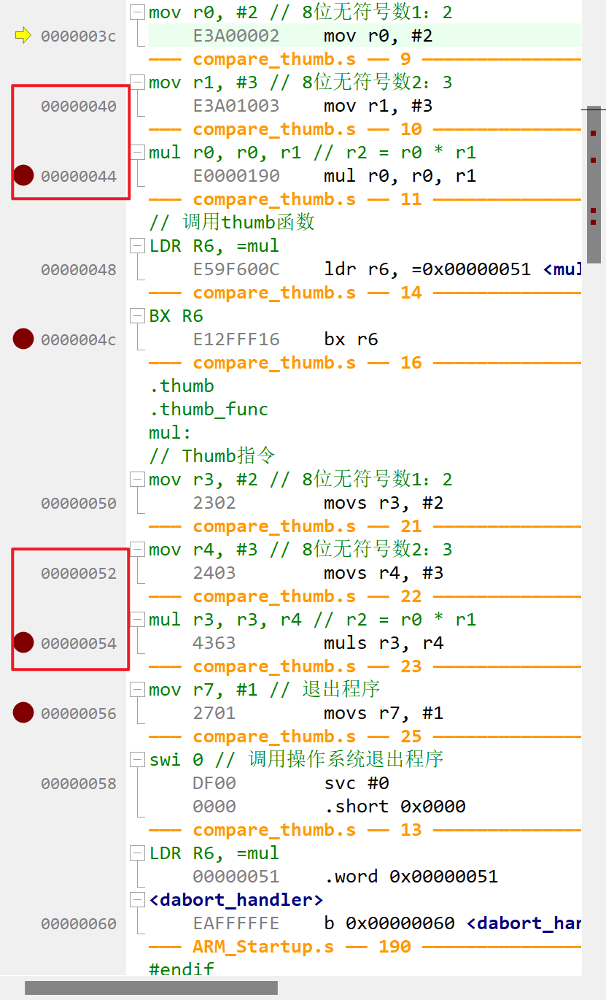

ARM指令为32位，每次pc+4，Thumb指令为16位，每次pc+2。


打断点依次运行程序：

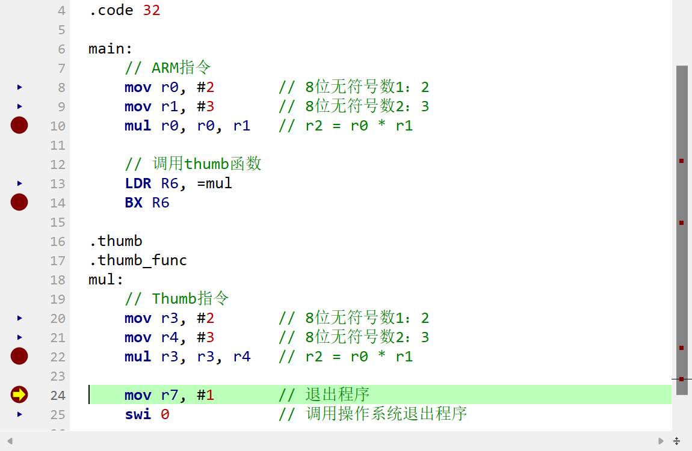

寄存器结果如下：

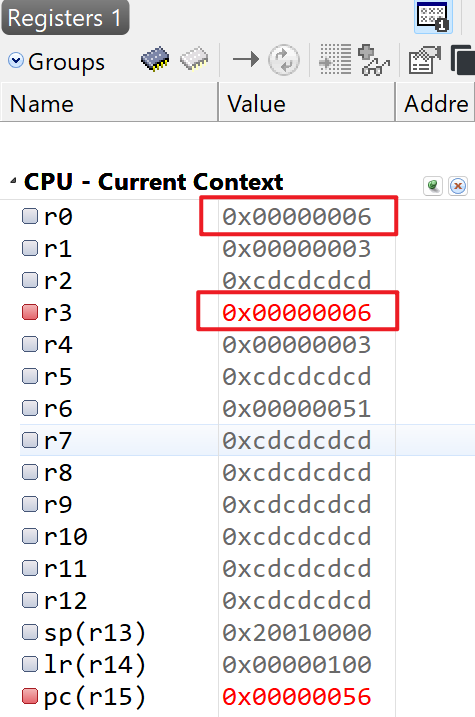

可以看到$r0$ 和 $r3$ 寄存器值均为6，且均为$2 * 3$ 的结果。

ARM指令和Thumb指令下执行任意两个8位无符号数相乘结果一致。


Thumb指令的使用参考了

> https://blog.csdn.net/cfy_phonex/article/details/18667299


## 二、A是 6X6 矩阵， B是3X3 矩阵，计算卷积 C = A * B


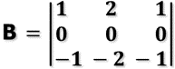


### 1. 汇编实现卷积

```assembly
// 定义卷积数据大小和卷积核大小
WIDTH       = 6
HEIGHT      = 6
KERNEL_SIZE = 3
// 定义输入矩阵
INPUT_MATRIX:
        .word 0x23, 0x25, 0x27, 0x85, 0x86, 0x87
        .word 0x33, 0x35, 0x35, 0x95, 0x95, 0x98
        .word 0x44, 0x45, 0x44, 0xA5, 0xA6, 0xA7
        .word 0xD5, 0xD6, 0xD7, 0x68, 0x69, 0x7A
        .word 0xFD, 0xFF, 0xFE, 0x42, 0x43, 0x43
        .word 0xEA, 0xEB, 0xEC, 0x55, 0x56, 0x56

// 卷积核
KERNEL_MATRIX:
       .word  1, 2, 1
       .word  0, 0, 0
       .word -1, -2, -1

// 主函数
// _start为程序入口点
      .section .text
      .global main  // 注意模拟器入口名必须使用main
      .code 32      // 必须要使用32， 避免使用Thumb指令

main:
    LDR R4, =INPUT_MATRIX   @ R4记录输入矩阵地址
    LDR R5, =KERNEL_MATRIX  @ R5记录卷积核地址
    LDR R6, =OUTPUT_MATRIX  @ R6记录输出矩阵地址
    MOV R0, #0              @ R0存储当前行,输入矩阵该开始行号
ROW_LOOP:
    MOV R1, #0              @ R1存储当前列 对于每一个行，初始化列
COLUMN_LOOP:
    MOV R2, #0              @ R2存储当前和， 对于每一次运算，初始化卷积核列号
    LDR R5, =KERNEL_MATRIX

//开始卷积运算
    MOV R3, #0     @ 初始化卷积核行标签
KERNEL_ROW_LOOP:
    MOV R7, #0     @ 初始化卷积核列标签
KERNEL_COLUMN_LOOP:
    LDR R8, [R4]   @ 载入输入矩阵元素
    ADD R4, R4, #4
    LDR R9, [R5]   @ 载入输入卷积核对应元素
    ADD R5, R5, #4
    // 输入与卷积核相乘
    MUL R10, R8, R9
    // 将结果累积
    ADD R2, R2, R10
    ADD R7, R7, #1 @ 卷积列标签增加
    CMP R7, #KERNEL_SIZE   @ 比较， 当前行的所有列都已经被计算；
    BLT KERNEL_COLUMN_LOOP @ 没有处理完， 继续处理

    SUB R4, R4, #KERNEL_SIZE * 4   @ 回到改行的起始地址
    ADD R4, R4, #WIDTH * 4     @ 地址变为下一行
    ADD R3, R3, #1 @ 核函数的行增加
    CMP R3, #KERNEL_SIZE @ 检查所有行是否被处理
    BLT KERNEL_ROW_LOOP @ 没有处理完， 继续循环,处理下一行
    STR R2, [R6] @ 将当前结果存入
    ADD R6, R6, #4 @ 存入地址增加
    SUB R4, R4, #WIDTH * KERNEL_SIZE * 4 @ 指向输入矩阵的指针回到初始位置
    ADD R4, R4, #4 @ 移动一列
    ADD R1, R1, #1 @ 列标签移动
    CMP R1, #(WIDTH - KERNEL_SIZE + 1) @ 当前行所有列是否被处理
    BLT COLUMN_LOOP @ 没有处理完全， 继续计算

    ADD R0, R0, #1 @ 行加一
    SUB R4, R4, #(WIDTH - KERNEL_SIZE + 1) * 4 @ 回行头
    ADD R4, R4, #WIDTH * 4
    CMP R0, #(HEIGHT - KERNEL_SIZE + 1)
    BLT ROW_LOOP

// End of program
    MOV R0, #0 @ Exit code
    MOV R7, #1 @ Syscall number for exit
    SWI 0 @ Call syscall
// 输出矩阵： 默认卷积核移动步长为1
OUTPUT_MATRIX:
  .word 0, 0, 0, 0
  .word 0, 0, 0, 0
  .word 0, 0, 0, 0
  .word 0, 0, 0, 0
```

- 在SEGGER中使用ARM9编译并Debug -> Go，运行结果如下

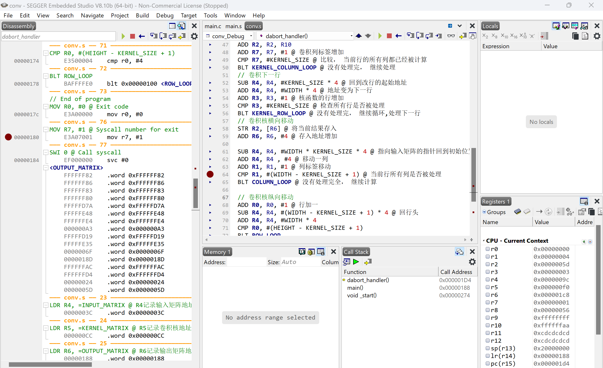

左侧得到输出矩阵。


### 2. C语言实现卷积

```c
/*********************************************************************
*                    SEGGER Microcontroller GmbH                     *
*                        The Embedded Experts                        *
**********************************************************************

-------------------------- END-OF-HEADER -----------------------------

File    : main.c
Purpose : Generic application start

*/

#include <stdio.h>
#include <stdlib.h>

/*********************************************************************
*
*       main()
*
*  Function description
*   Application entry point.
*/

#define ROW_A 6
#define COL_A 6
#define ROW_B 3
#define COL_B 3

void convolution(int A[][COL_A], int B[][COL_B], int C[][ COL_A - COL_B + 1])
{
    for (int i = 0; i < ROW_A - ROW_B + 1; i++)
    {
        for (int j = 0; j < COL_A - COL_B + 1; j++)
        {
            int sum = 0;
            for (int k = 0; k < ROW_B; k++)
            {
                for (int l = 0; l < COL_B; l++)
                {
                    sum += A[i + k][j + l] * B[k][l];
                }
            }
            C[i][j] = sum;
        }
    }
}

int main()
{
    int A[ROW_A][COL_A] = {
        {0x23, 0x25, 0x27, 0x85, 0x86, 0x87},
        {0x33, 0x35, 0x35, 0x95, 0x95, 0x98},
        {0x44, 0x45, 0x44, 0xA5, 0xA6, 0xA7},
        {0xD5, 0xD6, 0xD7, 0x68, 0x69, 0x7A},
        {0xFD, 0xFF, 0xFE, 0x42, 0x43, 0x43},
        {0xEA, 0xEB, 0xEC, 0x55, 0x56, 0x56}
    };

    int B[ROW_B][COL_B] = {
        {1,  2,   1},
        {0,  0,   0},
        {-1, -2, -1}
    };

    int C[ROW_A - ROW_B + 1][COL_A - COL_B + 1];

    convolution(A, B, C);

    printf("Resulting matrix C:\n");
    for (int i = 0; i < ROW_A - ROW_B + 1; i++)
    {
        for (int j = 0; j < COL_A - COL_B + 1; j++)
        {
            printf("%d \t", C[i][j]);
        }
        printf("\n");
    }

    return 0;
}


/*************************** End of file ****************************/

```


在SEGGER中使用arm9运行程序

新建工程后点击build, 成功。

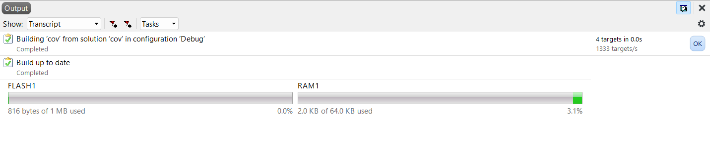

点击Debug -> Go，进入调试界面，运行之后可查看结果。

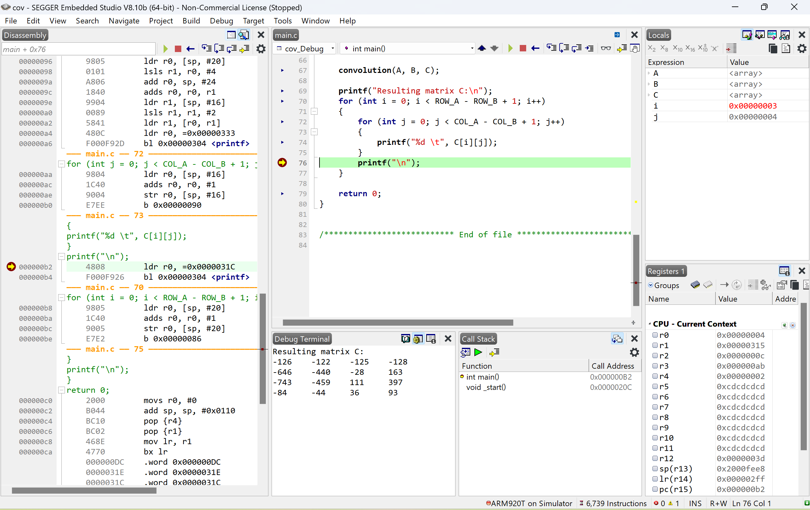

结果如下：

```
Resulting matrix C:
-126 	-122 	-125 	-128 	
-646 	-440 	-28 	163 	
-743 	-459 	111 	397 	
-84 	-44 	36 	93 	
```

以C[0] [0]位置为例，结果应为$ 0x23+2*0x25+0x27-0x44-2*0x45-0x44 = -126 = 0xFFFFFF82$ 。经检验，结果正确。

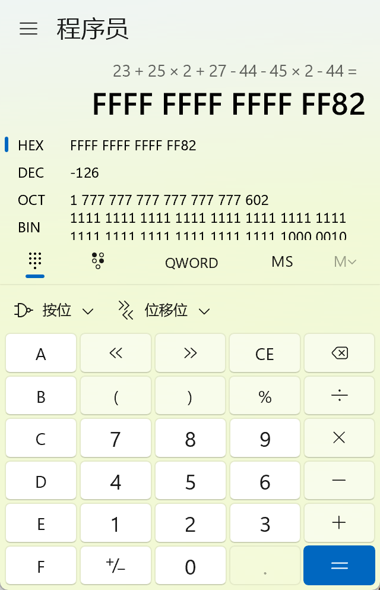

### 3. 使用python中scipy库中的convolve2d验证

代码：

``` python
import numpy as np
from scipy.signal import convolve2d

A = np.array([
    [0x23, 0x25, 0x27, 0x85, 0x86, 0x87],
    [0x33, 0x35, 0x35, 0x95, 0x95, 0x98],
    [0x44, 0x45, 0x44, 0xA5, 0xA6, 0xA7],
    [0xD5, 0xD6, 0xD7, 0x68, 0x69, 0x7A],
    [0xFD, 0xFF, 0xFE, 0x42, 0x43, 0x43],
    [0xEA, 0xEB, 0xEC, 0x55, 0x56, 0x56]
],  dtype=np.int32)

B = np.array([
    [1,  2,   1],
    [0,  0,   0],
    [-1, -2, -1]
], dtype=np.int32)

# 将卷积核B进行翻转
B_flipped = np.flipud(np.fliplr(B))

C = convolve2d(A, B_flipped, mode='valid')

print("Resulting matrix C:")
print(C)

print("Resulting matrix C (in machine representation):")
for row in C:
    for element in row:
        print(format(element  & 0xFFFFFFFF, '08x'))
```


运行结果如下：

``` 
Resulting matrix C:
[[-126 -122 -125 -128]
 [-646 -440  -28  163]
 [-743 -459  111  397]
 [ -84  -44   36   93]]
Resulting matrix C (in machine representation):
ffffff82
ffffff86
ffffff83
ffffff80
fffffd7a
fffffe48
ffffffe4
000000a3
fffffd19
fffffe35
0000006f
0000018d
ffffffac
ffffffd4
00000024
0000005d
```

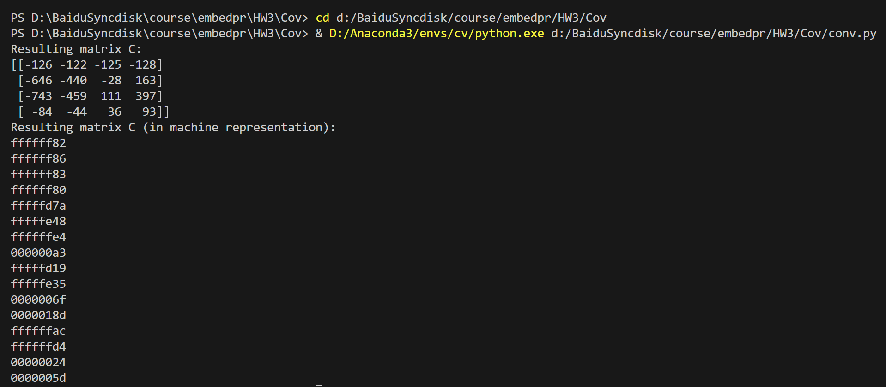


### 4. 结果对比

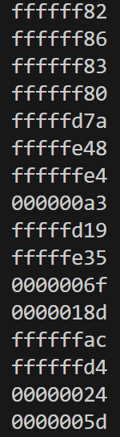  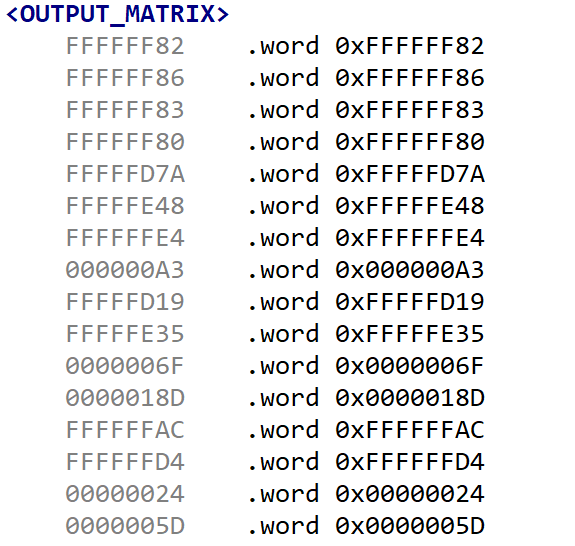

两者结果一致，说明汇编卷积结果正确！


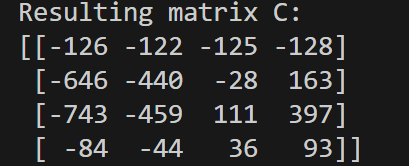 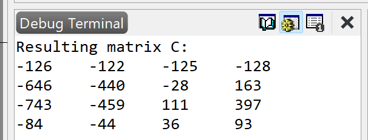

两者结果一致，说明C语言卷积结果正确！


