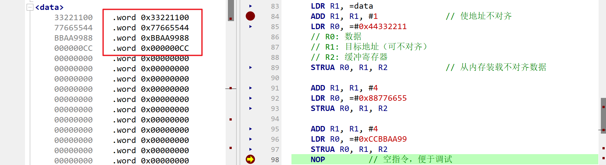
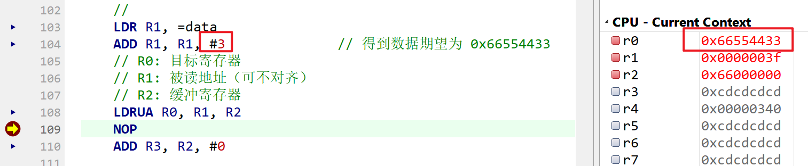
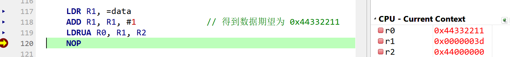
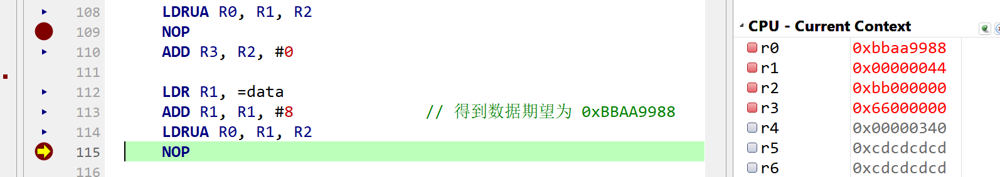

# HW4_宏定义

 

为了节省内存，避免内存中出现空洞，常采用不对齐的方式分配内存。然而，不对齐的数据，无法用指令“LDR”和“STR”正确从内存装载和写入内存。

  （1）请编写两条宏定义指令“LDRUA”和“STRUA”，能够将32位数据正确从内存装载和写入内容，而不论数据是否对齐。

  （2）请用编写程序，用实际数据验证两条自定义指令。

## 1. 汇编代码

1. `STRUA`宏用于将一个32位数据存储到内存中，存储的时候是按小端模式进行存储的，即从低地址开始存储每个字节。具体过程是先提取待存储数据的每个字节，然后逐个存入目标地址，并且根据存储顺序依次向后偏移一个字节的位置。
2. `LDRUA`宏用于从内存中读取数据，同样是按小端模式读取的，即从低地址开始读取每个字节，并将这些字节合成为一个32位数据。具体过程是先读取每个字节，然后根据读取顺序逐步左移位数相应的位，在与操作后合并到目标寄存器中。
3. 在`main`函数中，先使用`STRUA`宏将三个32位数据存入data段中的不对齐地址中，然后使用`LDRUA`宏从不对齐地址中读取数据并合成为32位数据，最后将合成的数据存入目标寄存器中。

``` assembly
data:
    .space 100  

.section .text
.code 32
.global main 


// ARM为小端模式，本程序设计为小端


// 确保Rtemp寄存器中无关键数据
// 设计不会破坏原始寄存的数值
// STRUA后  Rsrc, Rdest中存储的地址不会变化
.macro STRUA Rsrc, Rdest, Rtemp

    // 提取第1个字节
    AND \Rtemp, \Rsrc, #0x000000FF    // 使用与形式提取第一个字节
    STRB \Rtemp, [\Rdest]             // 以1字节存入内存
    ADD \Rdest, \Rdest, #1            // 存入后，指针累加

    // 提取第2个字节
    AND \Rtemp, \Rsrc, #0x0000FF00  
    LSR \Rtemp, \Rtemp, #8
    STRB \Rtemp, [\Rdest]
    ADD \Rdest, \Rdest, #1

    // 提取第3个字节
    AND \Rtemp, \Rsrc, #0x00FF0000 
    LSR \Rtemp, \Rtemp, #16  
    STRB \Rtemp, [\Rdest]
    ADD \Rdest, \Rdest, #1     

    // 提取第4个字节
    AND \Rtemp, \Rsrc, #0xFF000000   
    LSR \Rtemp, \Rtemp, #24  
    STRB \Rtemp, [\Rdest]
    ADD \Rdest, \Rdest, #1   

    SUB \Rdest, \Rdest, #4         // 指针复原
.endm


// 确保Rtemp寄存器中无关键数据
// LDRUA  Rsrc中存储的地址不会变化
.macro LDRUA Rdest, Rsrc, Rtemp
    
    LDR \Rdest, =#0x00000000         // 清空目标寄存器
    
    LDRB \Rtemp, [\Rsrc]
    ADD \Rsrc, \Rsrc, #1 
    ORR \Rdest, \Rdest, \Rtemp 
    
    LDRB \Rtemp, [\Rsrc]
    ADD \Rsrc, \Rsrc, #1 
    LSL \Rtemp, \Rtemp, #8
    ORR \Rdest, \Rdest, \Rtemp 

    LDRB \Rtemp, [\Rsrc]
    ADD \Rsrc, \Rsrc, #1 
    LSL \Rtemp, \Rtemp, #16
    ORR \Rdest, \Rdest, \Rtemp 

    LDRB \Rtemp, [\Rsrc]
    ADD \Rsrc, \Rsrc, #1 
    LSL \Rtemp, \Rtemp, #24
    ORR \Rdest, \Rdest, \Rtemp 

    SUB \Rsrc, \Rsrc, #4

   
.endm

main:
           
    
    //
    // ==============STRUA测试===============
    //
    LDR R1, =data               
    ADD R1, R1, #1              // 使地址不对齐
    LDR R0, =#0x44332211
    // R0: 数据  
    // R1: 目标地址（可不对齐）  
    // R2: 缓冲寄存器 
    STRUA R0, R1, R2            // 从内存装载不对齐数据  
    
    ADD R1, R1, #4
    LDR R0, =#0x88776655     
    STRUA R0, R1, R2

    ADD R1, R1, #4
    LDR R0, =#0xCCBBAA99    
    STRUA R0, R1, R2
    NOP         // 空指令，便于调试 

    //
    // ==============STRUA测试===============
    //
    LDR R1, =data       
    ADD R1, R1, #3              // 得到数据期望为 0x66554433
    // R0: 目标寄存器  
    // R1: 被读地址（可不对齐）  
    // R2: 缓冲寄存器 
    LDRUA R0, R1, R2
    NOP         
    ADD R3, R2, #0
    
    LDR R1, =data       
    ADD R1, R1, #8              // 得到数据期望为 0xBBAA9988
    LDRUA R0, R1, R2
    NOP

    LDR R1, =data       
    ADD R1, R1, #1              // 得到数据期望为 0x44332211
    LDRUA R0, R1, R2
    NOP
    

    MOV r7, #1                  
    MOV r0, #0               
    SVC 0      
```

## 2. 编译调试

在segger中使用ARM9进行编译调试。

### STRUA

- 写入未对齐数据

从`data`对应地址+1处开始，store`44332211`，store完成后再依次store`88776655`和`CCBBAA99`。

可以看到左侧data开始的数据空间第一个对齐的数据为`33221100`，后续空间也写入到了期望的值。




### LDRUA

- 读出未对齐数据

从`data`对应地址+3处开始load未对齐的数据，开始位置字节为33，读取4个字节，期望load的数据应为`66554433`，可以看到r0寄存器里load了期望的数据。




从`data`对应地址+1处开始load未对齐的数据，开始位置字节为11，读取4个字节，期望load的数据应为`44332211`，可以看到r0寄存器里load了期望的数据。




- 读出对齐数据

从`data`对应地址+8处开始load对齐的数据，开始位置字节为88，读取4个字节，期望load的数据应为`bbaa9988`，可以看到r0寄存器里load了期望的数据。

