[TOC]
## HW5_SWI

> 编写下列函数,然后编写程序通过软中断方式调用，计算出结果：
>
> （1）64位带进位的加法运算（asm）；
>
>  （2）两个32位数相乘，结果为64位的乘法运算（C 或 asm）

### 1. 汇编代码

``` assembly
//程序头
.section .text
.code 32


// 定义 swi_handler
// 是中断的关键
.global swi_handler
swi_handler:

    PUSH {R4-R12,LR}   // 将入口点压入栈

    LDR R7, [LR, #-4]       //获取 SWI 指令
    BIC R7, R7, #0xFF000000
    
    LDR R8, =#0x140701
    CMP R7, R8     
    BNE null_mul
    BL Adder_64

null_mul:    
    LDR R8, =#0x140710
    CMP R7, R8   
    BNE null
    BL Mul_32
    
null:
    POP {R4-R12,PC}   


// ARM汇编默认 R0-R3作为传递参数的寄存器，如果超出4的参数，需要存入内存
// R4-R11存储临时变量

.global Adder_64
// [R0, R1] (第一个加数的低位，高位）
// [R2, R3] (第二个加数的低位，高位）
// 返回值存入  [R0, R1]
Adder_64:
    PUSH {R4-R12}       // 保存寄存器状态
    
    // ADDS会将进位存入标志寄存器 (Carry Flag, C)
    ADDS R0, R0, R2     // 将第一个 32 位数的低 32 位加到结果中
    ADC R1, R1, R3      // 将第一个 32 位数的高 32 位加到结果中，包括进位

    POP {R4-R12}        // 恢复寄存器状态
    BX LR               // 返回，LR 中保存了返回地址


.global Mul_32
// R0, R1 被乘数和乘数
// 返回值存入  R2, R3 （低位，高位）
Mul_32:
    PUSH {R4-R12}       // 保存寄存器状态
    
    UMULL R3, R2, R0, R1

    POP {R4-R12}        // 恢复寄存器状态
    BX LR               // 返回，LR 中保存了返回地址


.global main 

main:
    //
    // ===========  test adder64 =============
    //

    // 第一个加数  0x1111_2222_AAAA_BBBB
    LDR R0, =#0xAAAABBBB
    LDR R1, =#0x11112222

    // 第二个加数  0x5555_6666_CCCC_DDDD
    LDR R2, =#0xCCCCCDDD
    LDR R3, =#0x55556666
    
    SWI 0x140701    // 调用64位加法     
    NOP


    //
    // ===========  test mul32 =============
    //
    s
    // 第一个乘数  0x1234_5678
    LDR R0, =#0x12345678
    
    // 第二个乘数  0x8765_4321
    LDR R1, =#0x87654321

    SWI 0x140710    // 调用32乘法
    NOP
```

### 2. 编译调试

#### 编译

在segger中使用ARM9进行编译调试。

本次工程用到了堆栈，需要将project->option->code->Runtime Memory Area中分配栈大小，这里修改该为了2048 字节。

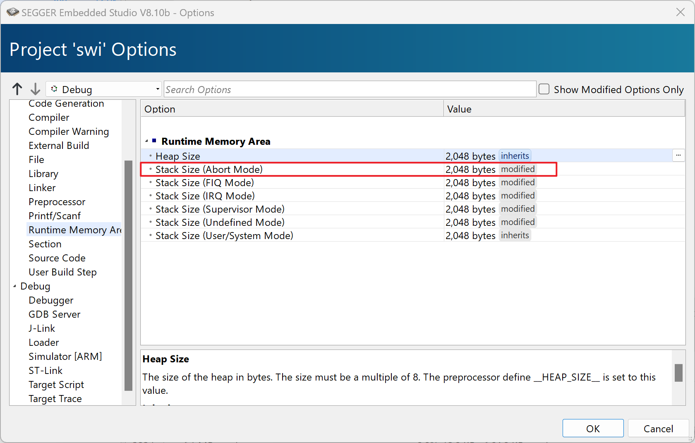


build查看资源占用情况

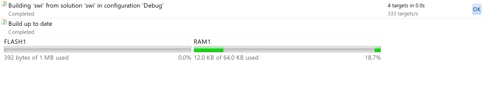

#### 进入软中断

点击Debug->Go，在`SWI`软中断和`NOP`空指令处打断点，运行调试。

进入中断向量表

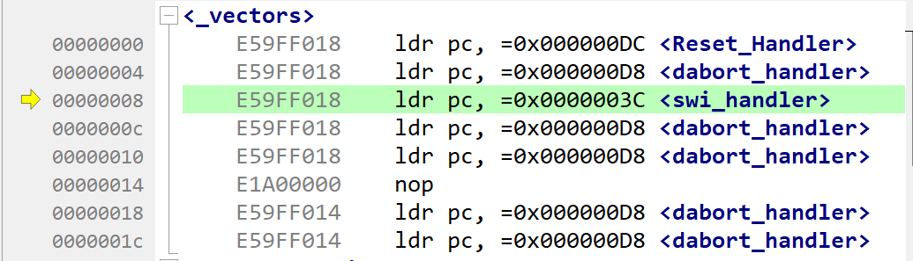

将寄存器状态压入栈

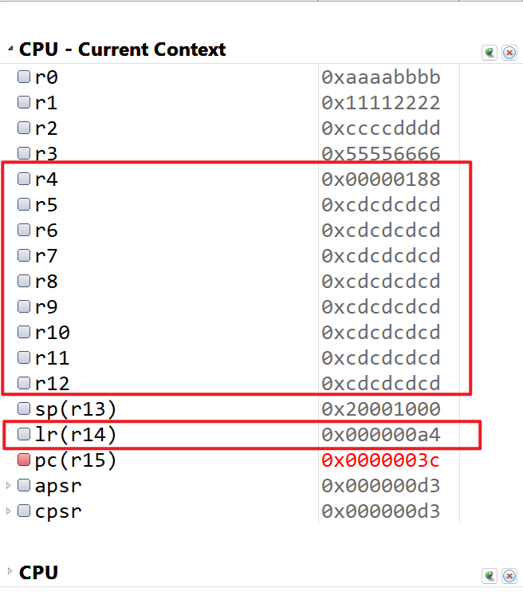

获取SWI指令

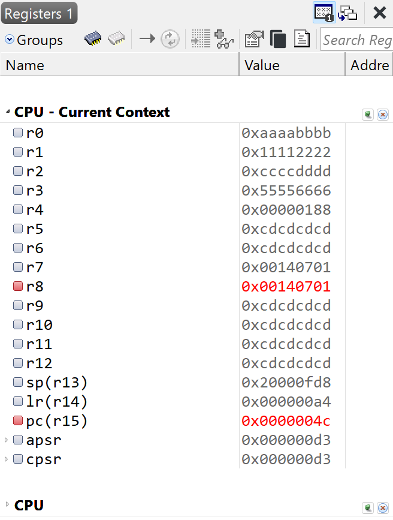

中断结束后将寄存器状态还原

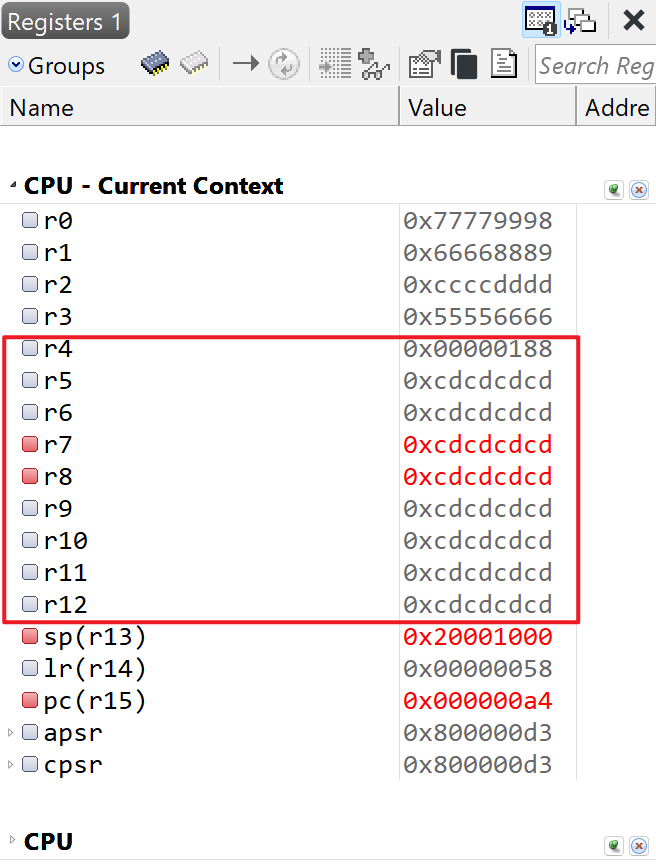


#### 64位带进位加法

首先调用加法函数`Adder_64`测试。

`R0、R1、R2、R3`中分别存储了两个加数的低位和高位。

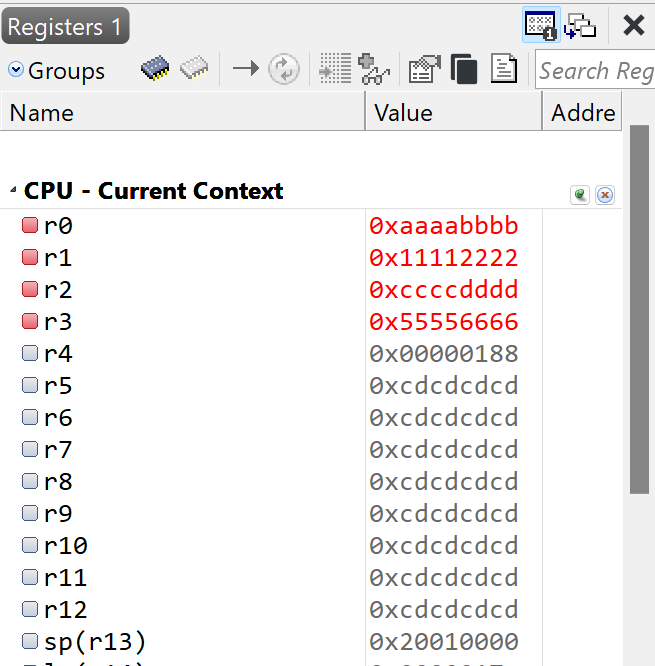

第一个加数为`0x1111_2222_aaaa_bbbb`

第二个加数为`0x5555_6666_cccc_dddd`


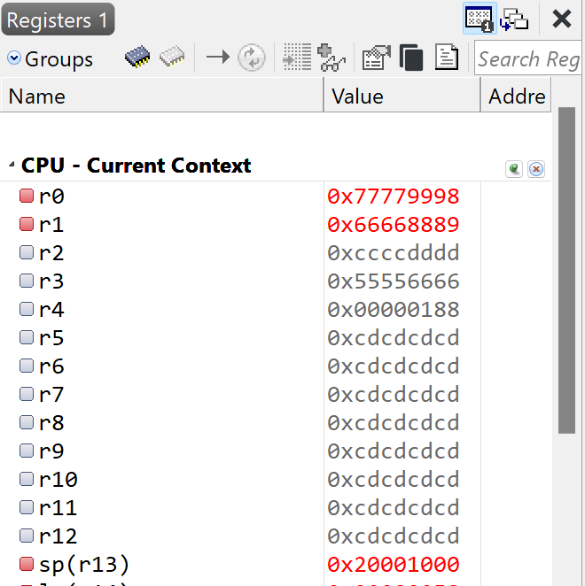

结果为`0x6666_8889_7777_9998` ，包含进位，结果与计算器计算结果一致！

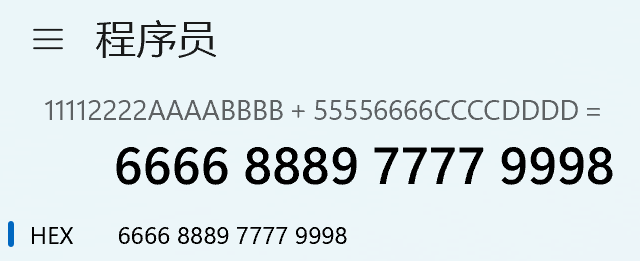

#### 32位乘法

调用加法函数`Mul_32`测试。

`R0、R1`中分别存储了乘数和被乘数。

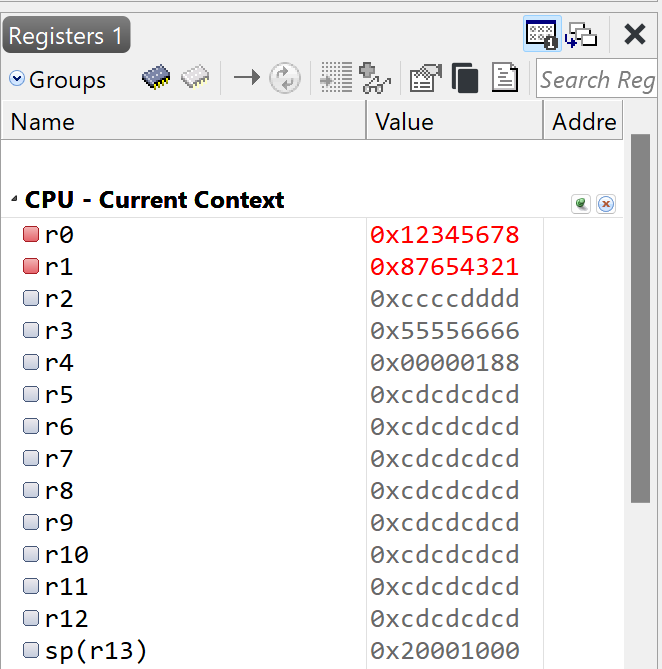

第一个乘数为`0x12345678`

第二个乘数S为`0x87654321`


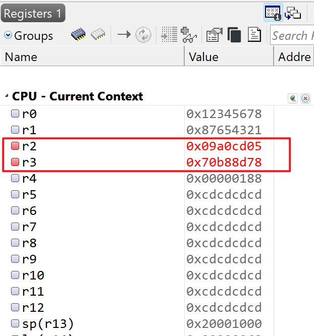

结果存储在`R2、R3`中，结果为`0x09a0_cd05_70b8_8d78` ，结果与计算器计算结果一致！

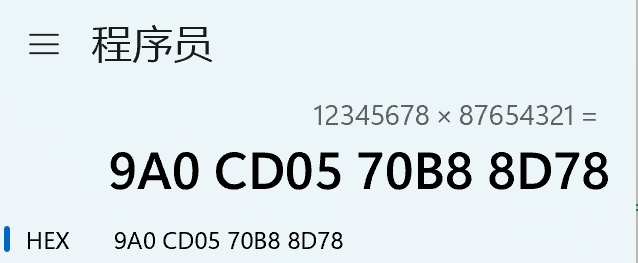

