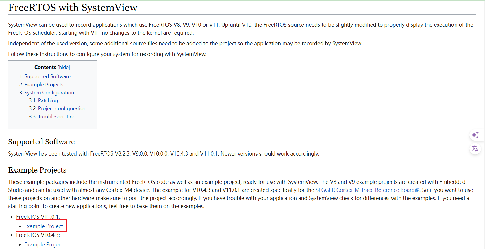
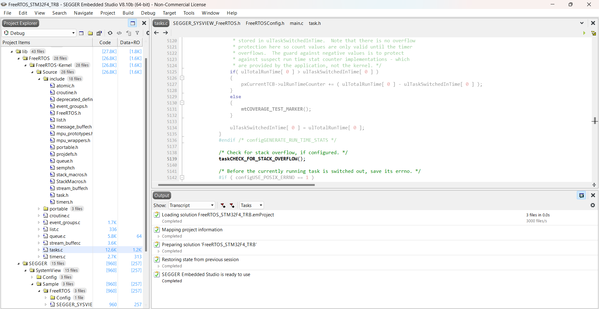
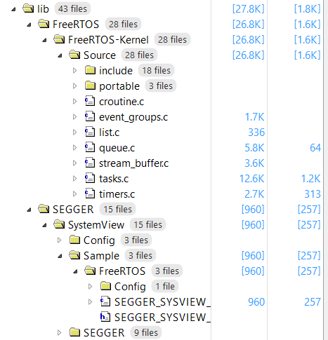
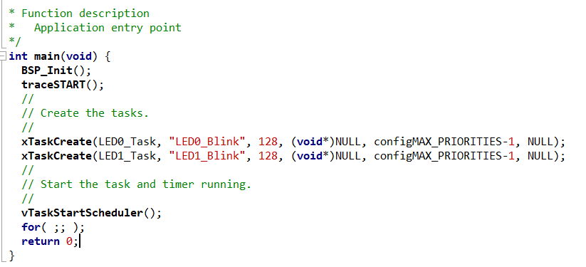
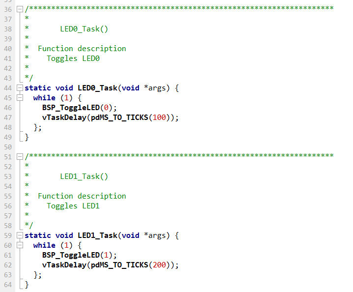
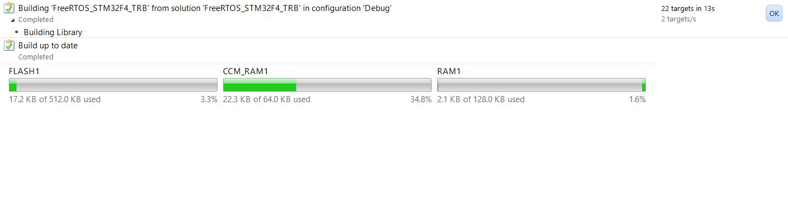
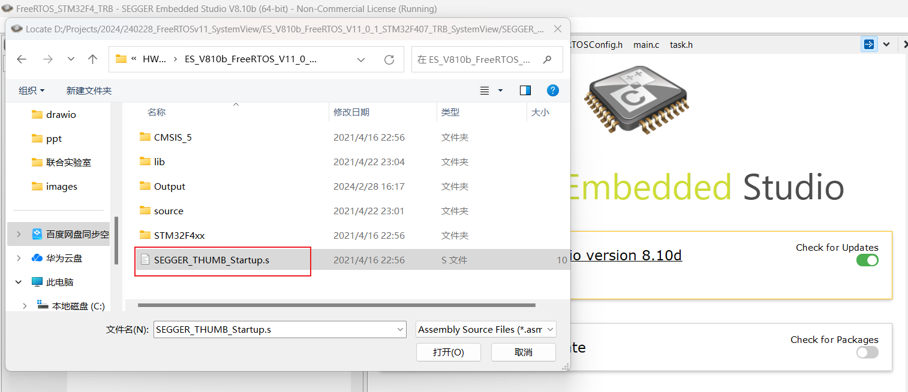
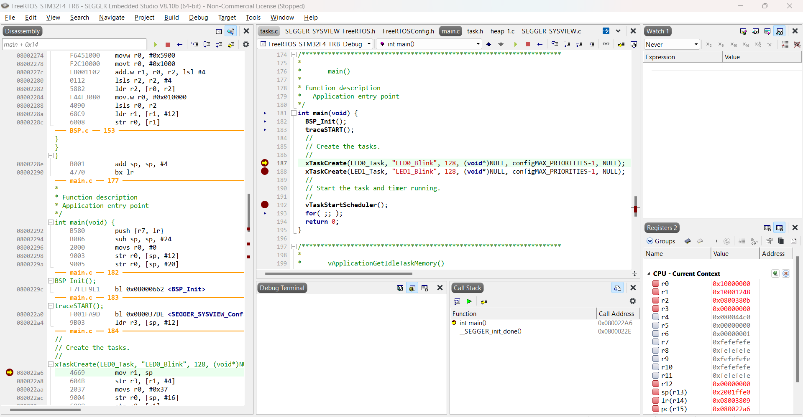

[TOC]

# HW6 程序分析

1. 选在一个嵌入式操作系统，实现不少于2个任务的应用演示。

2. 阅读 u-boot-2015.10\arch\arm\cpu目录下某处理器相关的start.s文件，或者其他boot文件，请说明：如果在不同处理器间移植u-boot，需要修改 start.s中的哪些语句？请在文件中标注出来。


## 在FreeRTOS 上实现任务

选择FreeRTOS

``` markdown
面向微控制器和小型微处理器的实时操作系统 (RTOS)(现在每 170 秒下载一次)。
```

优势

``` markdown
FreeRTOS是免费，MIT 开源许可；
支持广泛，很多半导体厂商产品的SDK， WIFI、蓝牙等协议栈的芯片或模块，丰富的IOT库；
简单，文件数量少；内核小，通常占用4k-9k Bytes  空间。
```

特点

``` markdown
内核支持抢占式，合作式和时间片调度；
具有低功耗的Tickless模式；
系统组件在创建时可以选择动态或者静态RAM；
功能包括：任务管理、时间管理、信号量、消息队列、内存管理、记录功能、软件定时器、协程等；
高移植性，代码主要用c语言编写；
堆栈溢出检测功能；
任务数量不限、任务优先级不限。
```


1. 进入官网下载例程项目

   > https://wiki.segger.com/FreeRTOS_with_SystemView

   下载例程项目，下载FreeRTOS V11.0.1

   
   
2. 在SEGGER中打开项目

   
   
3. 相关文件

   lib目录下分别定义了FreeRTOS的各个文件和相关的SEGGER文件  

   
   
4. 任务分析

   main.c 文件中有两个简单任务：LED灯闪烁吗，LED0每100ms翻转，LED1每200ms翻转。  

   

   
   
5. 编译build

   build之后，得到如下结果

   
   
6. debug

   点击Debug，选择项目文件中的`SEGGER_THUMB_Startup.s`文件即可

   

   


## 在不同处理器间移植u-boot

阅读 u-boot-2015.10\arch\arm\cpu目录下某处理器相关的start.s文件，或者其他boot文件，请说明：如果在不同处理器间移植u-boot，需要修改 start.s中的哪些语句？请在文件中标注出来。

参考文章

> https://www.crifan.com/files/doc/docbook/uboot_starts_analysis/release/html/uboot_starts_analysis.html


关于start.S汇编文件，主要做的事情就是系统的各个方面的初始化。

1. *设置CPU模式*

   总的来说，就是将CPU设置为SVC模式

2. *关闭看门狗*

   就是去设置对应的寄存器，将看门狗关闭。

3. *关闭中断*

   关闭中断，也是去设置对应的寄存器，即可。

4. *设置堆栈sp指针*

   设置堆栈sp指针，就是设置堆栈，让sp等于某个地址值，即可。

5. *清除bss段*

   将对应bss段，都设置为,0，即清零。

   其对应的地址空间，就是那些未初始化的全局变量之类的地址。

6. *异常中断处理*

   异常中断处理，就是实现对应的常见的那些处理中断的部分内容。


查看arm920t的start.S文件，针对每一部分进行分析和注释。

主要需要修改CPU模式、中断向量表、看门狗等部分。

``` assembly
/*
 *  armboot - Startup Code for ARM920 CPU-core
 *
 *  Copyright (c) 2001	Marius Gröger <mag@sysgo.de>
 *  Copyright (c) 2002	Alex Züpke <azu@sysgo.de>
 *  Copyright (c) 2002	Gary Jennejohn <garyj@denx.de>
 *
 * SPDX-License-Identifier:	GPL-2.0+
 */

// 该文件是ARM920 CPU核的启动代码
// 头文件，包含了一些宏定义，函数声明等
// 该文件主要是对CPU进行初始化，设置一些寄存器，关闭一些中断，设置内存时序等
// 目录：u-boot-2015.10/arch/arm/cpu/arm920t/start.S
// u-boot-2015.10/include/
// u-boot-2015.10/arch/arm/include/

#include <asm-offsets.h>
#include <common.h>
#include <config.h>

/*
 *************************************************************************
 *
 * Startup Code (called from the ARM reset exception vector)
 *
 * do important init only if we don't start from memory!
 * relocate armboot to ram
 * setup stack
 * jump to second stage
 *
 *************************************************************************
 */

	.globl	reset   // 定义全局符号reset, 该符号在链接时会被使用

reset:
	/*
	 * set the cpu to SVC32 mode
	 */
    // 设置CPU为SVC32模式
    // ** 针对不同的处理器，设置不同的模式 **
	mrs	r0, cpsr        // 读取当前程序状态寄存器的值到r0寄存器
	bic	r0, r0, #0x1f   // 将r0寄存器的值的低5位清零
	orr	r0, r0, #0xd3   // 将r0寄存器的值的低5位设置为0xd3
	msr	cpsr, r0

#if	defined(CONFIG_AT91RM9200DK) || defined(CONFIG_AT91RM9200EK)
	/*
	 * relocate exception table
	 */
    // 重新定位异常向量表
    // 将异常向量表的地址设置为0x0
    // ** 针对不同的处理器，设置不同的异常向量表 **
	ldr	r0, =_start
	ldr	r1, =0x0
	mov	r2, #16
copyex:
	subs	r2, r2, #1
	ldr	r3, [r0], #4
	str	r3, [r1], #4
	bne	copyex
#endif

#ifdef CONFIG_S3C24X0
	/* turn off the watchdog */
    // 关闭看门狗
    // ** 针对不同的处理器，看门狗寄存器定义不同，需要修改 **

# if defined(CONFIG_S3C2400)
#  define pWTCON	0x15300000
#  define INTMSK	0x14400008	/* Interrupt-Controller base addresses */
#  define CLKDIVN	0x14800014	/* clock divisor register */
#else
#  define pWTCON	0x53000000
#  define INTMSK	0x4A000008	/* Interrupt-Controller base addresses */
#  define INTSUBMSK	0x4A00001C
#  define CLKDIVN	0x4C000014	/* clock divisor register */
# endif
    // 将看门狗寄存器的值设置为0
	ldr	r0, =pWTCON
	mov	r1, #0x0
	str	r1, [r0]

	/*
	 * mask all IRQs by setting all bits in the INTMR - default
	 */
	mov	r1, #0xffffffff
	ldr	r0, =INTMSK
	str	r1, [r0]
# if defined(CONFIG_S3C2410)
	ldr	r1, =0x3ff
	ldr	r0, =INTSUBMSK
	str	r1, [r0]
# endif

	/* FCLK:HCLK:PCLK = 1:2:4 */
	/* default FCLK is 120 MHz ! */
	ldr	r0, =CLKDIVN
	mov	r1, #3
	str	r1, [r0]
#endif	/* CONFIG_S3C24X0 */

	/*
	 * we do sys-critical inits only at reboot,
	 * not when booting from ram!
	 */
#ifndef CONFIG_SKIP_LOWLEVEL_INIT
	bl	cpu_init_crit
#endif

    // 跳转到主函数
	bl	_main

/*------------------------------------------------------------------------------*/

	.globl	c_runtime_cpu_setup
c_runtime_cpu_setup:

	mov	pc, lr

/*
 *************************************************************************
 *
 * CPU_init_critical registers
 *
 * setup important registers
 * setup memory timing
 *
 *************************************************************************
 */
// 初始化CPU的关键寄存器，设置内存时序等

#ifndef CONFIG_SKIP_LOWLEVEL_INIT
cpu_init_crit:
	/*
	 * flush v4 I/D caches
	 */
    // 刷新v4 I/D缓存
	mov	r0, #0
	mcr	p15, 0, r0, c7, c7, 0	/* flush v3/v4 cache */
	mcr	p15, 0, r0, c8, c7, 0	/* flush v4 TLB */

	/*
	 * disable MMU stuff and caches
	 */
     // 关闭MMU，关闭缓存
	mrc	p15, 0, r0, c1, c0, 0
	bic	r0, r0, #0x00002300	@ clear bits 13, 9:8 (--V- --RS)
	bic	r0, r0, #0x00000087	@ clear bits 7, 2:0 (B--- -CAM)
	orr	r0, r0, #0x00000002	@ set bit 2 (A) Align
	orr	r0, r0, #0x00001000	@ set bit 12 (I) I-Cache
	mcr	p15, 0, r0, c1, c0, 0

	/*
	 * before relocating, we have to setup RAM timing
	 * because memory timing is board-dependend, you will
	 * find a lowlevel_init.S in your board directory.
	 */
     // 在重新定位之前，我们必须设置RAM时序
	mov	ip, lr

	bl	lowlevel_init

	mov	lr, ip
	mov	pc, lr
#endif /* CONFIG_SKIP_LOWLEVEL_INIT */

```

