[TOC]

#  练习7：程序优化

1. 在ARM处理器上, 自己选程序：

   （1）分别选择o0, o1, o2, o3 优化选项，比较所生成程序的大小和执行速度。

   （2）选择其中一个函数，尝试分析o0和o3选项所生成的程序指令数差别。

# 创建项目并编写程序

在Segger中选择ARM9处理器创建项目

选在第三次练习的C语言卷积作为自选程序

``` C
#include <stdio.h>
#include <stdlib.h>

/*********************************************************************
*
*       main()
*
*  Function description
*   Application entry point.
*/

#define ROW_A 6
#define COL_A 6
#define ROW_B 3
#define COL_B 3

void convolution(int A[][COL_A], int B[][COL_B], int C[][ COL_A - COL_B + 1])
{
    for (int i = 0; i < ROW_A - ROW_B + 1; i++)
    {
        for (int j = 0; j < COL_A - COL_B + 1; j++)
        {
            int sum = 0;
            for (int k = 0; k < ROW_B; k++)
            {
                for (int l = 0; l < COL_B; l++)
                {
                    sum += A[i + k][j + l] * B[k][l];
                }
            }
            C[i][j] = sum;
        }
    }
}

int main()
{
    int A[ROW_A][COL_A] = {
        {0x23, 0x25, 0x27, 0x85, 0x86, 0x87},
        {0x33, 0x35, 0x35, 0x95, 0x95, 0x98},
        {0x44, 0x45, 0x44, 0xA5, 0xA6, 0xA7},
        {0xD5, 0xD6, 0xD7, 0x68, 0x69, 0x7A},
        {0xFD, 0xFF, 0xFE, 0x42, 0x43, 0x43},
        {0xEA, 0xEB, 0xEC, 0x55, 0x56, 0x56}
    };

    int B[ROW_B][COL_B] = {
        {1,  2,   1},
        {0,  0,   0},
        {-1, -2, -1}
    };

    int C[ROW_A - ROW_B + 1][COL_A - COL_B + 1];

    convolution(A, B, C);

    printf("Resulting matrix C:\n");
    for (int i = 0; i < ROW_A - ROW_B + 1; i++)
    {
        for (int j = 0; j < COL_A - COL_B + 1; j++)
        {
            printf("%d \t", C[i][j]);
        }
        printf("\n");
    }

    return 0;
}
```


- 在`Project Explorer `里右击Project，选择option

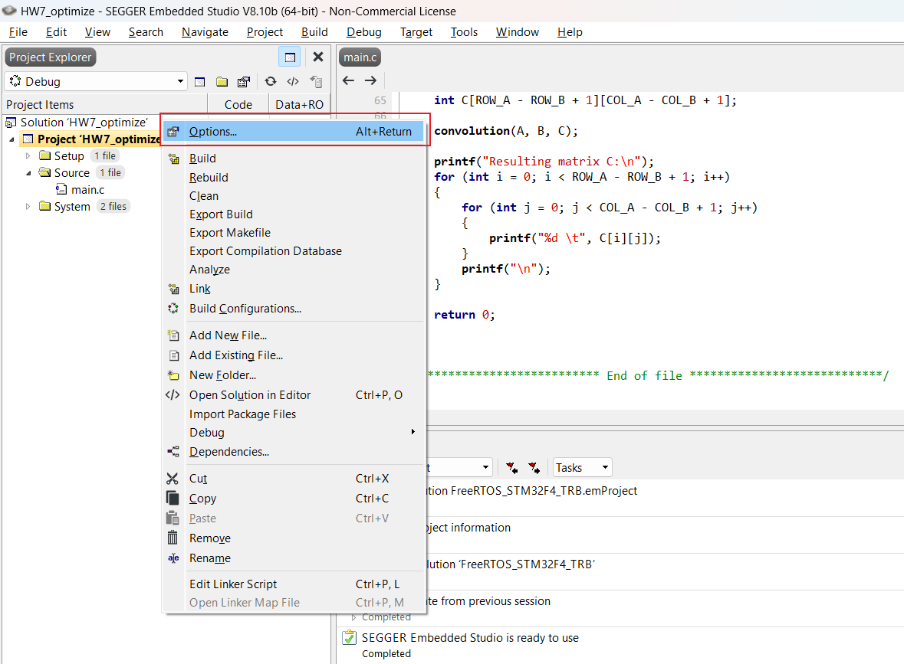

- 将Compiler改为gcc

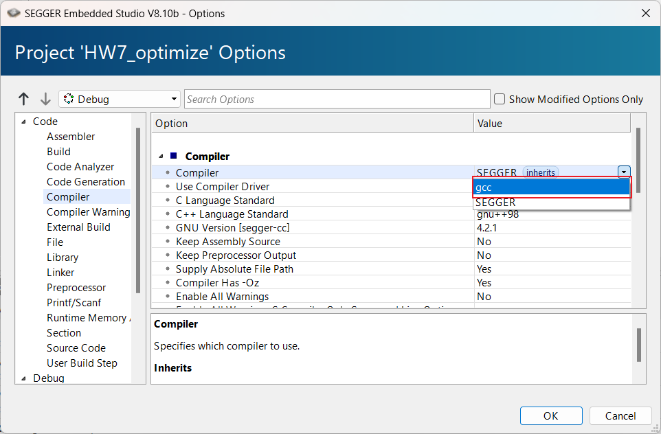

- 选择Additional C/C++ Compiler Options，依次选择不同的优化选项

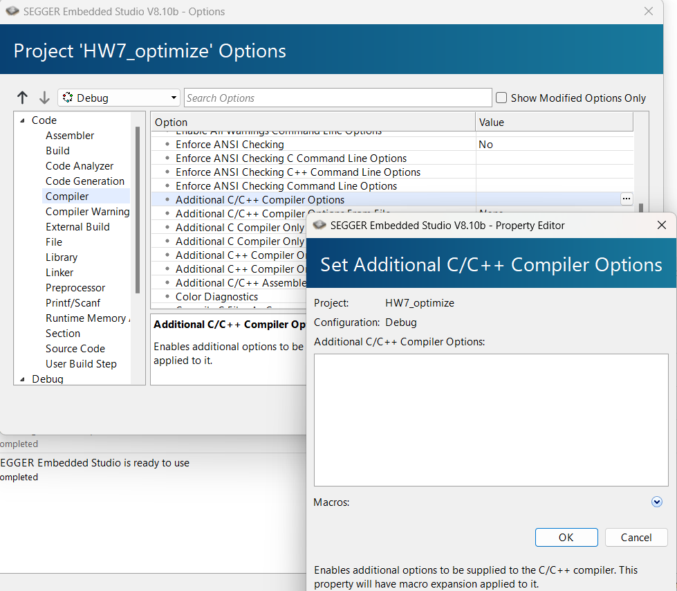


# 比较生成程序大小

## O0优化

- 选择O0优化选项

O0是编译器优化级别中的最低级别，表示关闭所有优化。当使用O0优化时，编译器只会进行基本的编译工作，例如语法分析、语义分析和代码生成，而不会进行任何针对性的优化操作。

在O0优化级别下，生成的代码通常比较简单直观，易于调试和理解。但由于缺乏优化操作，所以可能会导致程序运行速度较慢，占用内存较多。

一般来说，在调试阶段可以选择关闭优化（即使用O0优化级别），这样可以更容易地定位问题和进行调试。但在发布产品时，为了提高程序的性能，通常会选择更高级别的优化，如O1、O2或O3。


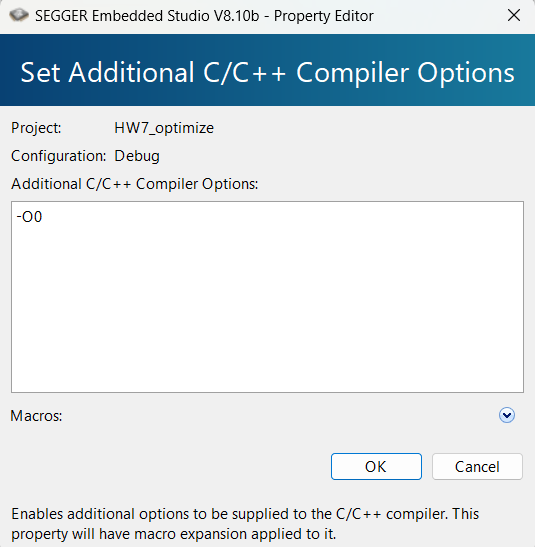

- 编译项目，可以得到程序大小为926bytes

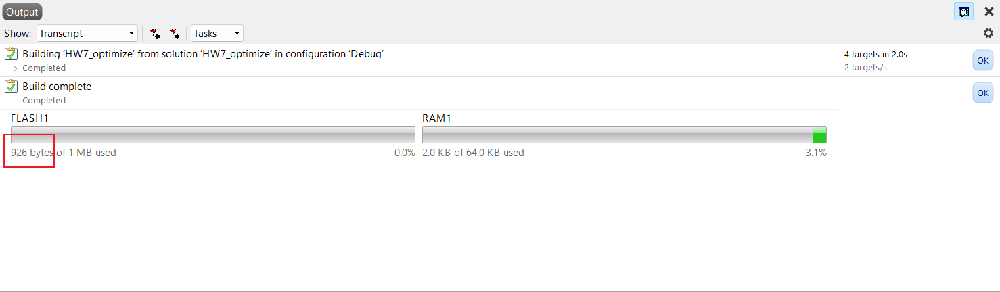

- 由于Segger不支持直接查看程序运行时间，这里我们查看器指令运行条数来大致估算器时间，在反汇编程序的 return 0处打上断点，执行程序后，可以发现共执行7832条指令


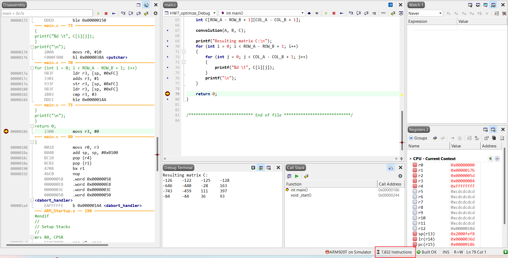

## O1优化

- 选择O1优化选项

O1是编译器优化级别中的中等级别，介于O0和O2之间。在O1优化级别下，编译器会进行一些基本的优化操作，但并不会过分地影响编译时间。一般来说，O1优化会对代码进行一些简单的优化，例如常量传播、局部变量优化、函数内联等。

相比于O0，使用O1优化可以提高程序的运行速度和减少内存占用，但相应地也会增加编译时间。O1优化通常是一个折中的选择，适合在需要考虑性能的情况下使用。

总的来说，O1优化级别可以在一定程度上改善程序的性能，同时保持较短的编译时间，适合许多应用场景的需求。

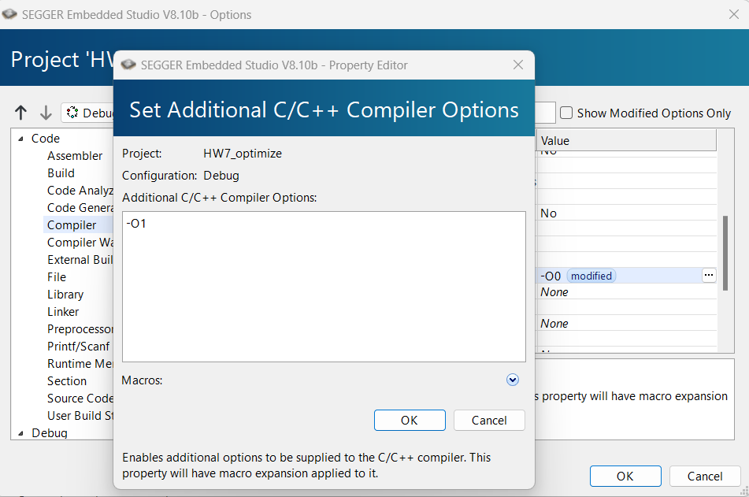


- 编译项目，可以得到程序大小为857bytes

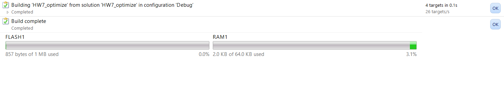

- 在反汇编程序的 return 0处打上断点，执行程序后，可以发现共执行2943条指令

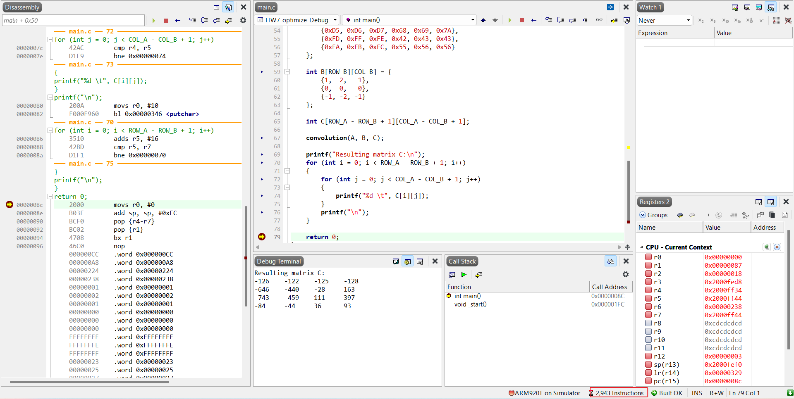


## O2优化

- 选择O2优化选项

O2是编译器优化级别中的较高级别，介于O1和O3之间。在O2优化级别下，编译器会进行更多的优化操作，以提高生成代码的运行速度和性能。

一般来说，使用O2优化级别会比O1优化级别生成更高效的代码，但相应地也会增加编译时间。在O2优化级别下，编译器可能会进行更复杂的优化，例如循环优化、数据流分析、函数内联等。这些优化可以使得程序运行更快，占用更少的内存，并具有更好的并行性。

总的来说，O2优化级别适合对程序性能要求较高的场景，可以在一定程度上提高程序的执行效率和响应速度。然而，需要注意的是，O2优化可能会导致编译时间延长，因此在选择优化级别时需要根据实际情况权衡性能和编译时间之间的关系。


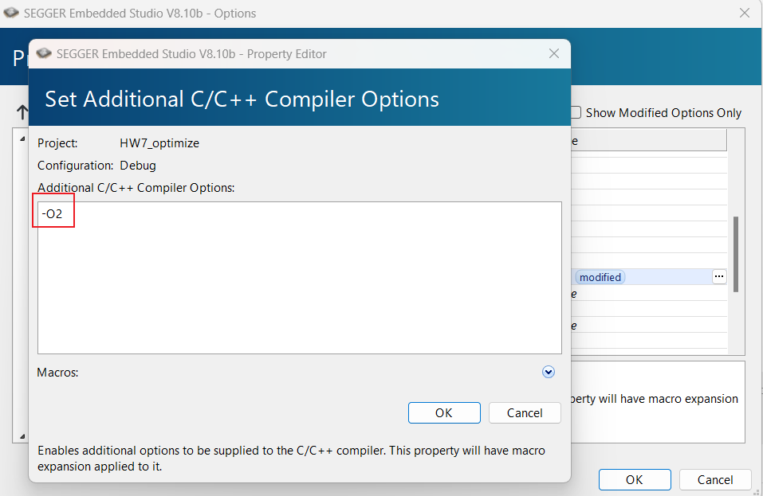


- 编译项目，可以得到程序大小为845bytes

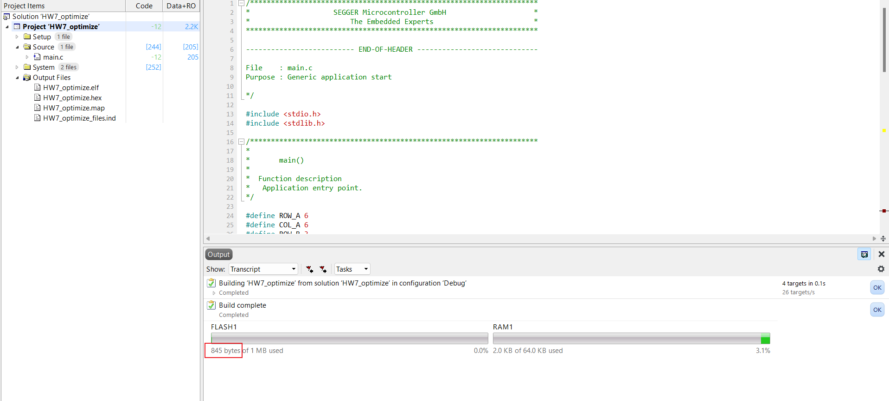


- 在反汇编程序的 return 0处打上断点，执行程序后，可以发现共执行2857条指令

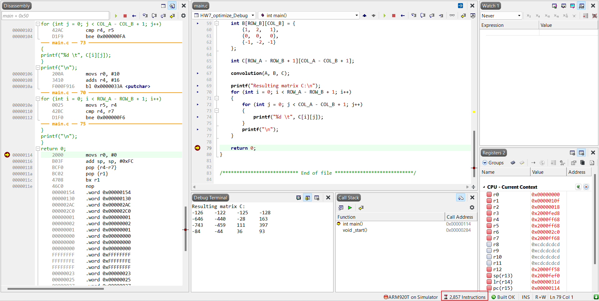


## O3优化

- 选择O3优化选项

O3是编译器优化级别中的最高级别，表示最大程度的优化。在O3优化级别下，编译器会尝试进行各种复杂的优化操作，以提高程序的性能和效率。

使用O3优化可以使生成的代码更加高效，通常会包括以下一些优化技术：

1. 内联函数：将函数直接插入调用点，减少函数调用的开销。
2. 循环展开：复制循环体内的代码多次，减少循环开销。
3. 向量化：将循环转换为向量操作，提高并行度。
4. 数据流分析：对程序的数据流进行分析，以便更好地优化内存访问模式。
5. 指令调度：调整指令顺序以充分利用处理器的流水线并行执行能力。

通过这些优化操作，O3优化可以显著提高程序的运行速度和性能。但需要注意的是，O3优化可能会导致编译时间增长，并且有时候可能会使得生成的代码变得更复杂，难以阅读和调试。

因此，在选择优化级别时，需要根据具体的需求和情况来决定是否使用O3优化。如果对性能要求较高且可以接受较长的编译时间，那么O3优化是一个不错的选择。

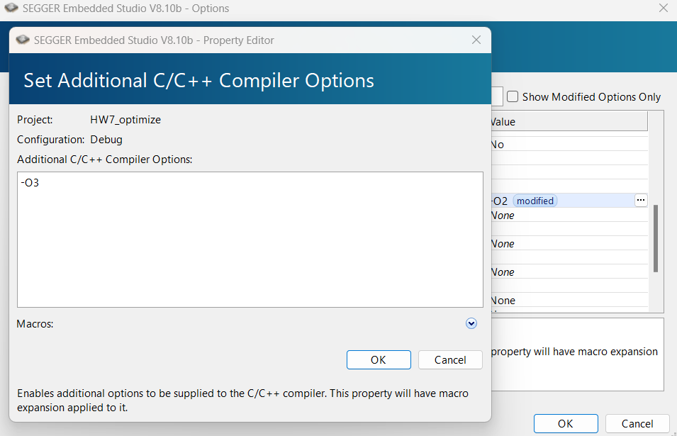


- 编译项目，可以得到程序大小为1021bytes

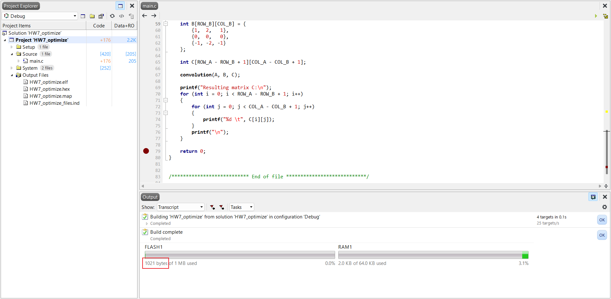


- 在反汇编程序的 return 0处打上断点，执行程序后，可以发现共执行1890条指令

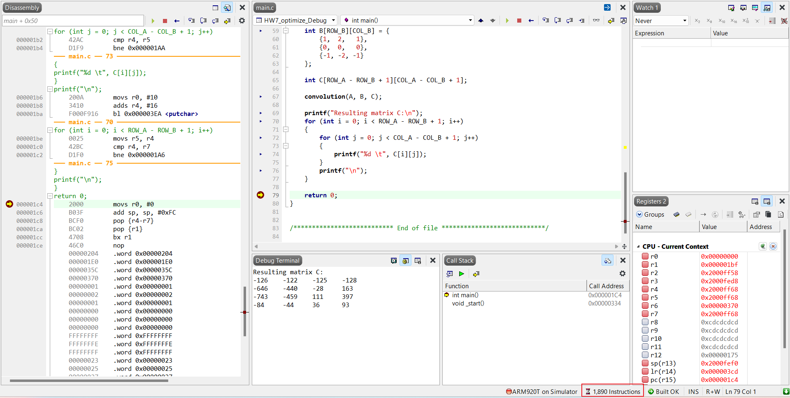


# 比较o0和o3选项所生成的程序指令数差别

- O0优化

在Output Files -> HW7_optimize.elf中查看反汇编

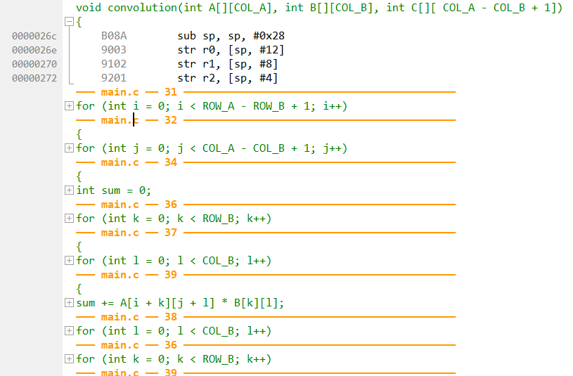

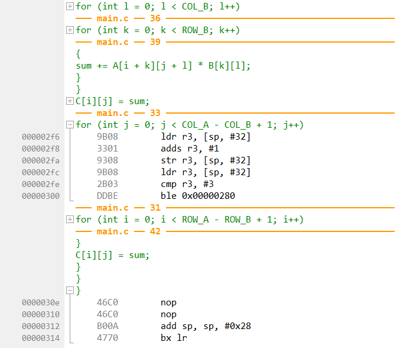

指令数为0x314 - 0x26c = 0xA8 = 168条

``` assembly
#define ROW_B 3
#define COL_B 3
void convolution(int A[][COL_A], int B[][COL_B], int C[][ COL_A - COL_B + 1])
{
    B08A        sub sp, sp, #0x28
    9003        str r0, [sp, #12]
    9102        str r1, [sp, #8]
    9201        str r2, [sp, #4]
--- main.c -- 31 -------------------------------------------
for (int i = 0; i < ROW_A - ROW_B + 1; i++)
    2300        movs r3, #0
    9309        str r3, [sp, #0x24]
    E046        b 0x00000308
--- main.c -- 32 -------------------------------------------
{
for (int j = 0; j < COL_A - COL_B + 1; j++)
    2300        movs r3, #0
    9308        str r3, [sp, #32]
    E03D        b 0x000002FC
--- main.c -- 34 -------------------------------------------
{
int sum = 0;
    2300        movs r3, #0
    9307        str r3, [sp, #28]
--- main.c -- 36 -------------------------------------------
for (int k = 0; k < ROW_B; k++)
    2300        movs r3, #0
    9306        str r3, [sp, #24]
    E02A        b 0x000002E0
--- main.c -- 37 -------------------------------------------
{
for (int l = 0; l < COL_B; l++)
    2300        movs r3, #0
    9305        str r3, [sp, #20]
    E021        b 0x000002D4
--- main.c -- 39 -------------------------------------------
{
sum += A[i + k][j + l] * B[k][l];
    9A09        ldr r2, [sp, #0x24]
    9B06        ldr r3, [sp, #24]
    18D3        adds r3, r2, r3
    001A        movs r2, r3
    0013        movs r3, r2
    005B        lsls r3, r3, #1
    189B        adds r3, r3, r2
    00DB        lsls r3, r3, #3
    001A        movs r2, r3
    9B03        ldr r3, [sp, #12]
    189B        adds r3, r3, r2
    9908        ldr r1, [sp, #32]
    9A05        ldr r2, [sp, #20]
    188A        adds r2, r1, r2
    0092        lsls r2, r2, #2
    58D1        ldr r1, [r2, r3]
    9A06        ldr r2, [sp, #24]
    0013        movs r3, r2
    005B        lsls r3, r3, #1
    189B        adds r3, r3, r2
    009B        lsls r3, r3, #2
    001A        movs r2, r3
    9B02        ldr r3, [sp, #8]
    189B        adds r3, r3, r2
    9A05        ldr r2, [sp, #20]
    0092        lsls r2, r2, #2
    58D3        ldr r3, [r2, r3]
    434B        muls r3, r1
    9A07        ldr r2, [sp, #28]
    18D3        adds r3, r2, r3
    9307        str r3, [sp, #28]
--- main.c -- 38 -------------------------------------------
for (int l = 0; l < COL_B; l++)
    9B05        ldr r3, [sp, #20]
    3301        adds r3, #1
    9305        str r3, [sp, #20]
    9B05        ldr r3, [sp, #20]
    2B02        cmp r3, #2
    DDDA        ble 0x00000290
--- main.c -- 36 -------------------------------------------
for (int k = 0; k < ROW_B; k++)
    9B06        ldr r3, [sp, #24]
    3301        adds r3, #1
    9306        str r3, [sp, #24]
    9B06        ldr r3, [sp, #24]
    2B02        cmp r3, #2
    DDD1        ble 0x0000028A
--- main.c -- 39 -------------------------------------------
{
sum += A[i + k][j + l] * B[k][l];
}
}
C[i][j] = sum;
    9B09        ldr r3, [sp, #0x24]
    011B        lsls r3, r3, #4
    9A01        ldr r2, [sp, #4]
    18D3        adds r3, r2, r3
    9A08        ldr r2, [sp, #32]
    0092        lsls r2, r2, #2
    9907        ldr r1, [sp, #28]
    50D1        str r1, [r2, r3]
--- main.c -- 33 -------------------------------------------
for (int j = 0; j < COL_A - COL_B + 1; j++)
    9B08        ldr r3, [sp, #32]
    3301        adds r3, #1
    9308        str r3, [sp, #32]
    9B08        ldr r3, [sp, #32]
    2B03        cmp r3, #3
    DDBE        ble 0x00000280
--- main.c -- 31 -------------------------------------------
for (int i = 0; i < ROW_A - ROW_B + 1; i++)
    9B09        ldr r3, [sp, #0x24]
    3301        adds r3, #1
    9309        str r3, [sp, #0x24]
    9B09        ldr r3, [sp, #0x24]
    2B03        cmp r3, #3
    DDB5        ble 0x0000027A
--- main.c -- 42 -------------------------------------------
}
C[i][j] = sum;
}
}
}
    46C0        nop
    46C0        nop
    B00A        add sp, sp, #0x28
    4770        bx lr
```


- O3优化

在Output Files -> HW7_optimize.elf中查看反汇编

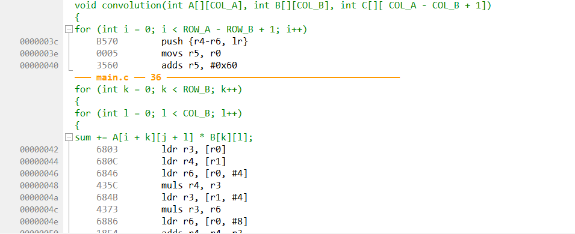

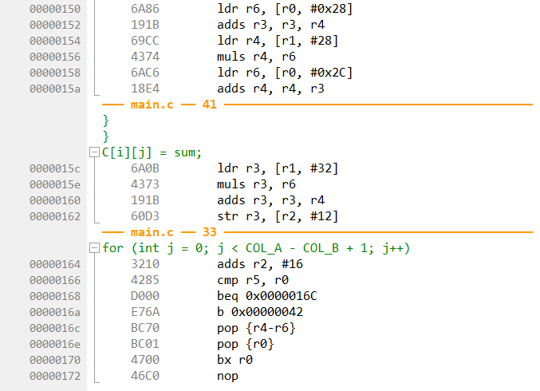

指令数为0x172 - 0x03c = 0x136 = 310条。

``` assembly
#define COL_B 3
void convolution(int A[][COL_A], int B[][COL_B], int C[][ COL_A - COL_B + 1])
{
for (int i = 0; i < ROW_A - ROW_B + 1; i++)
    B570        push {r4-r6, lr}
    0005        movs r5, r0
    3560        adds r5, #0x60
--- main.c -- 36 -------------------------------------------
for (int k = 0; k < ROW_B; k++)
{
for (int l = 0; l < COL_B; l++)
{
sum += A[i + k][j + l] * B[k][l];
    6803        ldr r3, [r0]
    680C        ldr r4, [r1]
    6846        ldr r6, [r0, #4]
    435C        muls r4, r3
    684B        ldr r3, [r1, #4]
    4373        muls r3, r6
    6886        ldr r6, [r0, #8]
    18E4        adds r4, r4, r3
    688B        ldr r3, [r1, #8]
    4373        muls r3, r6
    6986        ldr r6, [r0, #24]
    191B        adds r3, r3, r4
    68CC        ldr r4, [r1, #12]
    4374        muls r4, r6
    69C6        ldr r6, [r0, #28]
    18E4        adds r4, r4, r3
    690B        ldr r3, [r1, #16]
    4373        muls r3, r6
    6A06        ldr r6, [r0, #32]
    191B        adds r3, r3, r4
    694C        ldr r4, [r1, #20]
    4374        muls r4, r6
    6B06        ldr r6, [r0, #0x30]
    18E4        adds r4, r4, r3
    698B        ldr r3, [r1, #24]
    4373        muls r3, r6
    6B46        ldr r6, [r0, #0x34]
    191B        adds r3, r3, r4
    69CC        ldr r4, [r1, #28]
    4374        muls r4, r6
    6B86        ldr r6, [r0, #0x38]
    18E4        adds r4, r4, r3
--- main.c -- 41 -------------------------------------------
}
}
C[i][j] = sum;
    6A0B        ldr r3, [r1, #32]
    4373        muls r3, r6
    191B        adds r3, r3, r4
    6013        str r3, [r2]
--- main.c -- 40 -------------------------------------------
sum += A[i + k][j + l] * B[k][l];
    6843        ldr r3, [r0, #4]
    680C        ldr r4, [r1]
    6886        ldr r6, [r0, #8]
    435C        muls r4, r3
    684B        ldr r3, [r1, #4]
    4373        muls r3, r6
    68C6        ldr r6, [r0, #12]
    18E4        adds r4, r4, r3
    688B        ldr r3, [r1, #8]
    4373        muls r3, r6
    69C6        ldr r6, [r0, #28]
    191B        adds r3, r3, r4
    68CC        ldr r4, [r1, #12]
    4374        muls r4, r6
    6A06        ldr r6, [r0, #32]
    18E4        adds r4, r4, r3
    690B        ldr r3, [r1, #16]
    4373        muls r3, r6
    6A46        ldr r6, [r0, #0x24]
    191B        adds r3, r3, r4
    694C        ldr r4, [r1, #20]
    4374        muls r4, r6
    6B46        ldr r6, [r0, #0x34]
    18E4        adds r4, r4, r3
    698B        ldr r3, [r1, #24]
    4373        muls r3, r6
    6B86        ldr r6, [r0, #0x38]
    191B        adds r3, r3, r4
    69CC        ldr r4, [r1, #28]
    4374        muls r4, r6
    6BC6        ldr r6, [r0, #0x3C]
    18E4        adds r4, r4, r3
--- main.c -- 41 -------------------------------------------
}
}
C[i][j] = sum;
    6A0B        ldr r3, [r1, #32]
    4373        muls r3, r6
    191B        adds r3, r3, r4
    6053        str r3, [r2, #4]
--- main.c -- 40 -------------------------------------------
sum += A[i + k][j + l] * B[k][l];
    6883        ldr r3, [r0, #8]
    680C        ldr r4, [r1]
    68C6        ldr r6, [r0, #12]
    435C        muls r4, r3
    684B        ldr r3, [r1, #4]
    4373        muls r3, r6
    6906        ldr r6, [r0, #16]
    18E4        adds r4, r4, r3
    688B        ldr r3, [r1, #8]
    4373        muls r3, r6
    6A06        ldr r6, [r0, #32]
    191B        adds r3, r3, r4
    68CC        ldr r4, [r1, #12]
    4374        muls r4, r6
    6A46        ldr r6, [r0, #0x24]
    18E4        adds r4, r4, r3
    690B        ldr r3, [r1, #16]
    4373        muls r3, r6
    6A86        ldr r6, [r0, #0x28]
    191B        adds r3, r3, r4
    694C        ldr r4, [r1, #20]
    4374        muls r4, r6
    6B86        ldr r6, [r0, #0x38]
    18E4        adds r4, r4, r3
    698B        ldr r3, [r1, #24]
    4373        muls r3, r6
    6BC6        ldr r6, [r0, #0x3C]
    191B        adds r3, r3, r4
    69CC        ldr r4, [r1, #28]
    4374        muls r4, r6
    6C06        ldr r6, [r0, #0x40]
    18E4        adds r4, r4, r3
--- main.c -- 41 -------------------------------------------
}
}
C[i][j] = sum;
    6A0B        ldr r3, [r1, #32]
    4373        muls r3, r6
    191B        adds r3, r3, r4
    6093        str r3, [r2, #8]
--- main.c -- 40 -------------------------------------------
sum += A[i + k][j + l] * B[k][l];
    68C3        ldr r3, [r0, #12]
    680C        ldr r4, [r1]
    6906        ldr r6, [r0, #16]
    435C        muls r4, r3
    684B        ldr r3, [r1, #4]
    4373        muls r3, r6
    6946        ldr r6, [r0, #20]
    18E4        adds r4, r4, r3
    688B        ldr r3, [r1, #8]
    3018        adds r0, #24
    4373        muls r3, r6
    68C6        ldr r6, [r0, #12]
    191B        adds r3, r3, r4
    68CC        ldr r4, [r1, #12]
    4374        muls r4, r6
    6906        ldr r6, [r0, #16]
    18E4        adds r4, r4, r3
    690B        ldr r3, [r1, #16]
    4373        muls r3, r6
    6946        ldr r6, [r0, #20]
    191B        adds r3, r3, r4
    694C        ldr r4, [r1, #20]
    4374        muls r4, r6
    6A46        ldr r6, [r0, #0x24]
    18E4        adds r4, r4, r3
    698B        ldr r3, [r1, #24]
    4373        muls r3, r6
    6A86        ldr r6, [r0, #0x28]
    191B        adds r3, r3, r4
    69CC        ldr r4, [r1, #28]
    4374        muls r4, r6
    6AC6        ldr r6, [r0, #0x2C]
    18E4        adds r4, r4, r3
--- main.c -- 41 -------------------------------------------
}
}
C[i][j] = sum;
    6A0B        ldr r3, [r1, #32]
    4373        muls r3, r6
    191B        adds r3, r3, r4
    60D3        str r3, [r2, #12]
--- main.c -- 33 -------------------------------------------
for (int j = 0; j < COL_A - COL_B + 1; j++)
    3210        adds r2, #16
    4285        cmp r5, r0
    D000        beq 0x0000016C
    E76A        b 0x00000042
    BC70        pop {r4-r6}
    BC01        pop {r0}
    4700        bx r0
    46C0        nop
```

相比O0，虽然在表面上一个循环中指令条数增加，但是对于总体程序，其降低了循环造成的额外寻址，从而降低了平均循环的指令条数，进而大幅降低在整体程序的指令条数上  

当使用O3优化时，编译器会尝试进行更多的优化操作，包括内联函数、循环展开、向量化等。这些优化操作可能会导致生成的反汇编指令条数增加的原因有以下几点：

1. 内联函数：O3优化可能会将一些小的函数内联到调用它们的地方，这样可以减少函数调用的开销，但也会使得生成的代码变长。
2. 循环展开：O3优化可能会对循环进行展开，即将循环体内的代码复制多次来减少循环开销，这也会增加生成的代码长度。
3. 向量化：O3优化还可能会将一些循环转换为向量操作，以提高并行度，但这同样会增加生成的代码长度。


# 总结

总结

| 优化选项 | 程序大小(Byte) | 指令数 | convolution函数指令条数 |
| -------- | -------------- | ------ | ----------------------- |
| O0       | 926            | 7832   | 168                     |
| O1       | 857            | 2943   | -                       |
| O2       | 845            | 2857   | -                       |
| O3       | 1021           | 1890   | 310                     |


1. O3优化级别下程序的大小最大（1021 Byte），这可能是由于O3级别的优化操作更多，生成的代码更加复杂，导致程序大小增加。
2. 在指令数方面，O3优化明显比O0优化要少（1890条 vs 7832条），说明O3优化能够通过各种优化技术减少指令数，从而提高程序的效率。
3. convolution函数在O3优化级别下的指令条数最多（310条），这表明该函数在O3优化级别下进行了更多的优化操作，可能包括循环展开、向量化等。

可以看出不同优化级别对程序的大小和性能都有影响，需要根据具体需求选择合适的优化级别以达到最佳的性能和效率。