# HW8 GPIO

参考例程，用不同的按键和LED显示方式实现键盘控制LED：

（1）在仿真器上成功调试程序；

（2）将程序烧入板上，实现上电后自动执行。


## 工程环境设置

在工程导航栏选中`project 'gpio_led'`, 右键选择`option`

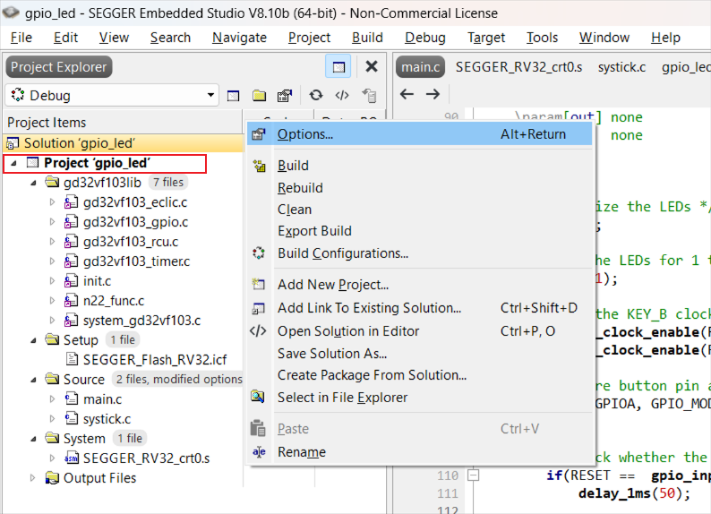


- 汇编器选择`gcc`

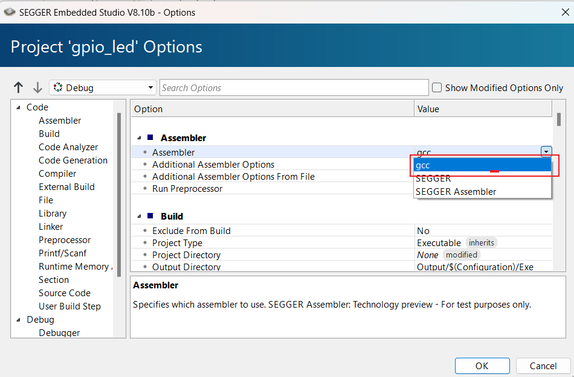


- 设置堆和栈大小

这里保持默认大小2048 bytes, 可按需修改

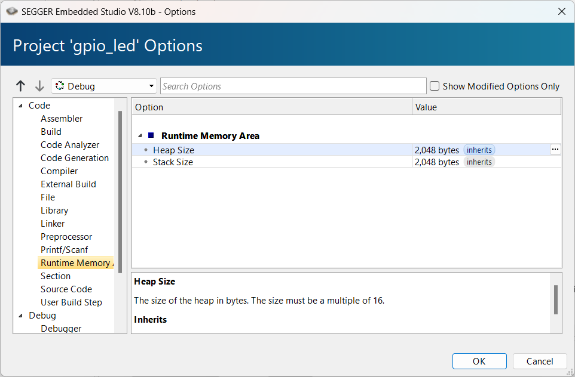


- 设置用户include路径

选择Preprocessor -> User Include Directories

修改为自己放置`GD32VF103lib\Device\Include`的路径

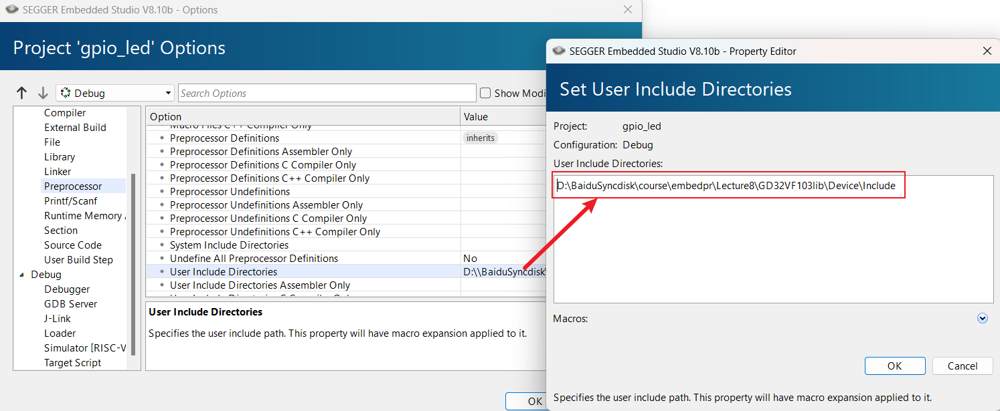


- 选择调试方式

使用开发板调试, 设置`Target Connection`为`GDB Server`

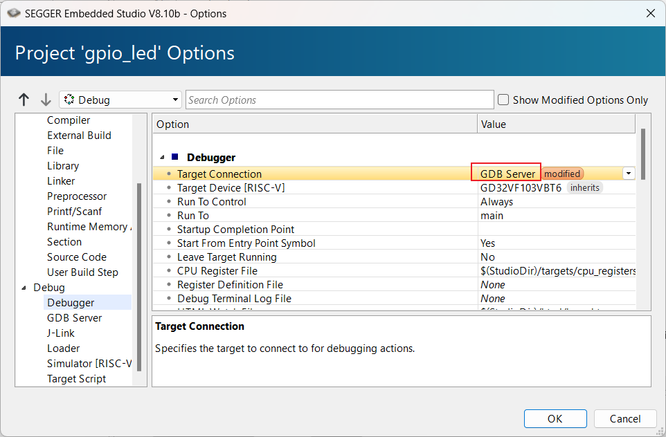

## 例程调试

### 编译

确保所有文件包含在工作路径下,编译成功

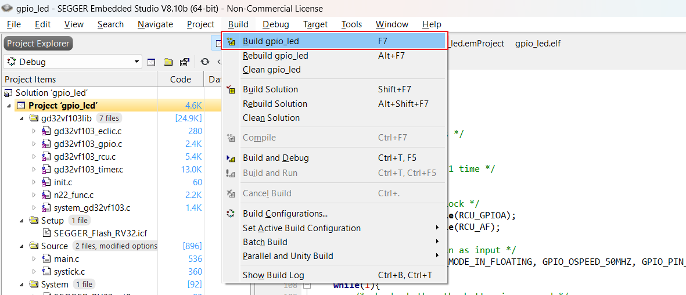

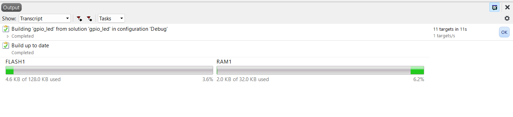

### 连接开发板

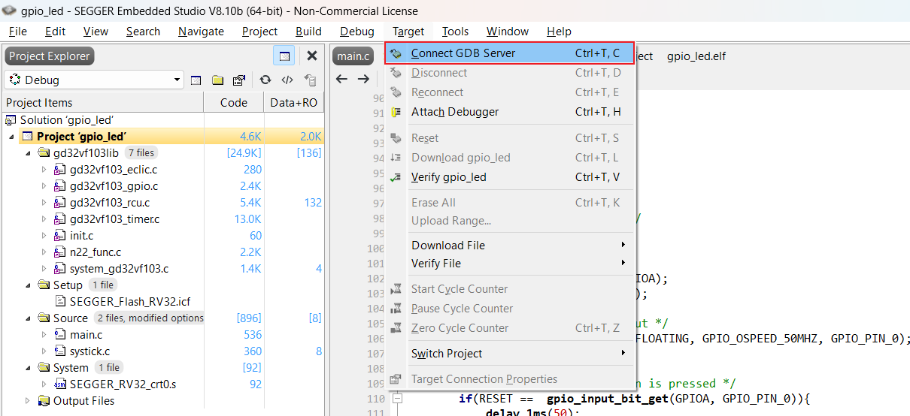

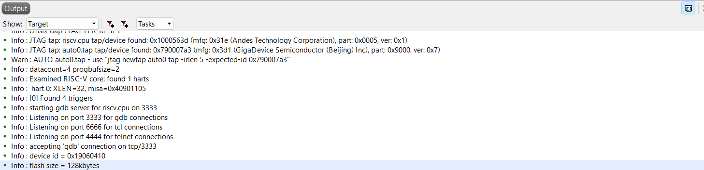


### 调试

- 点击Debug -> Go, 开始调试


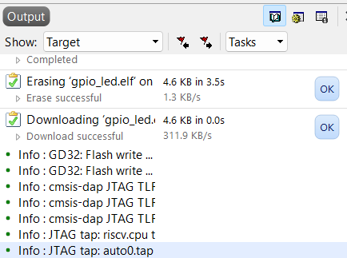


### 调试结果, KEY_B, LED2

当LED2熄灭时, 拨动按键B, LED2亮起;

当LED2亮起时, 拨动按键B, LED2熄灭.

与程序行为一致

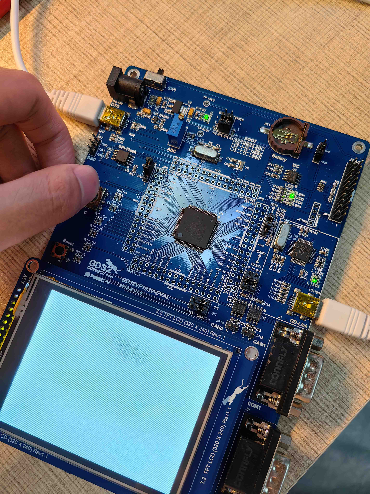


## 修改按键和LED

### 查表

由ppt可知按键KEY和LED对应的GPIO编号分别如下:


按该表修改对应的代码即可.

### 修改代码

下面展示了修改按键为KEY_A, LED 为 LED4的代码.

``` c
int main(void)
{
    /* initialize the LEDs */
    led_init();
    
    /* flash the LEDs for 1 time */
    led_flash(1);
    
    /* enable the KEY_A clock */
    rcu_periph_clock_enable(RCU_GPIOA);	
    rcu_periph_clock_enable(RCU_AF);

    /* configure button pin as input */
    gpio_init(GPIOA, GPIO_MODE_IN_FLOATING, GPIO_OSPEED_50MHZ, GPIO_PIN_0); // 按键A对应pin为PA0
    
    while(1){
        /* check whether the button is pressed */
        if(RESET ==  gpio_input_bit_get(GPIOA, GPIO_PIN_0)){
            delay_1ms(50);

            /* check whether the button is pressed */
            if(RESET == gpio_input_bit_get(GPIOA, GPIO_PIN_0)){
                gpio_bit_write(GPIOE, GPIO_PIN_1, (bit_status)(1-gpio_input_bit_get(GPIOE, GPIO_PIN_1))); // LED4 对应pin为PE1
            }
            while(RESET == gpio_input_bit_get(GPIOA, GPIO_PIN_0)){
            }
        }
    }
}
```


### KEY_B, LED1

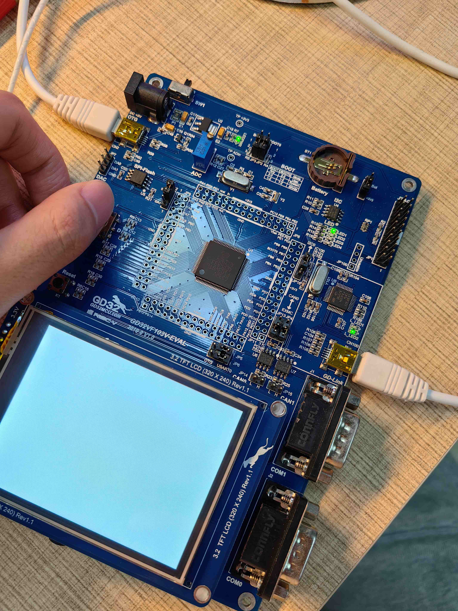


### KEY_B, LED3


### KEY_B, LED4

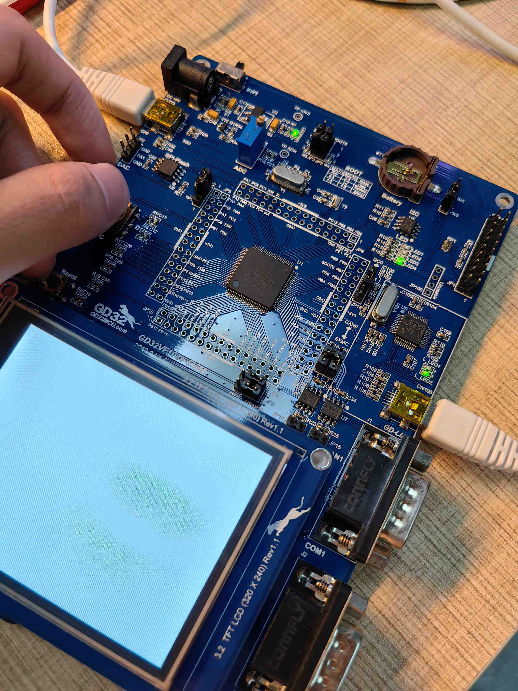


### KEY_A, LED4

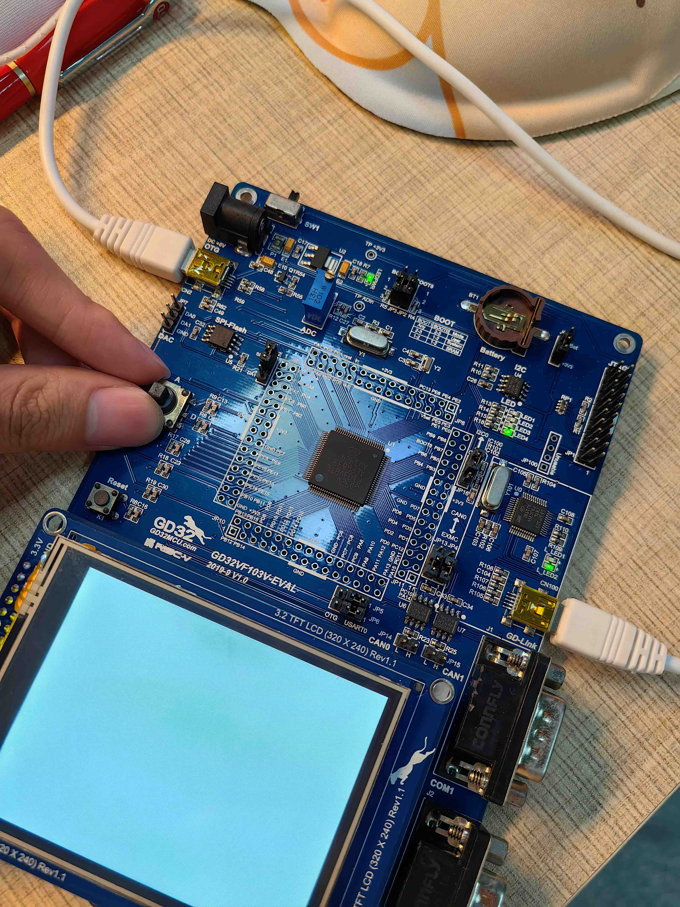

