[TOC]

# HW9 exmc_tp

二选一：

1.用中断方式实现键盘控制 LED， 分别用 A、B、C 和 D 四个按键控制 LED1、LED2、LED3 和LED4 的状态。要求：按下键后，点亮该键对应的 LED, 同时关闭其他 三个 LED。

2.用中断方式实现触摸屏控制 LED, 分别用 button1、button2、button3 和 button4 四个按键控制 LED1、LED2、LED3 和 LED4 的状态


## 工程环境设置  

根据[HW8](https://github.com/huangxc6/Embedded_Microprocessor_System_24Spring/tree/main/HW8_gpio) 工程环境配置配置即可。

本次新增`gd32vf103_eval`，注意将其添加到`User Include Directories `中。

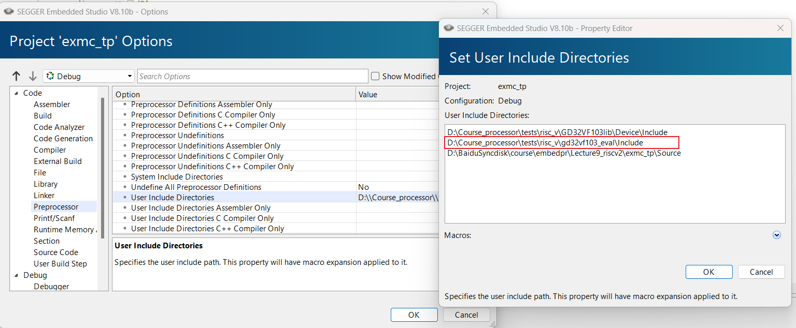

如果build报错根据错误内容添加对应的库文件即可。

## 编译调试

### 编译

Build -> Build exmc_tp

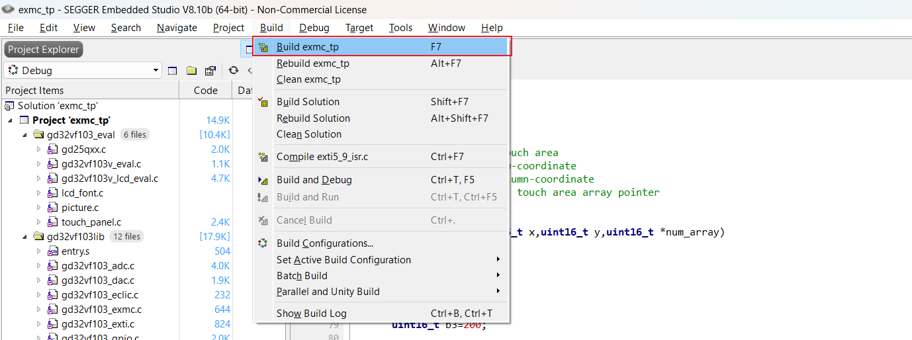

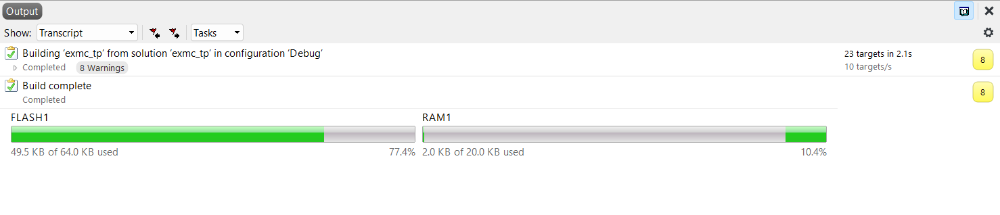

### 连接开发板

Target -> Connect GDB Server

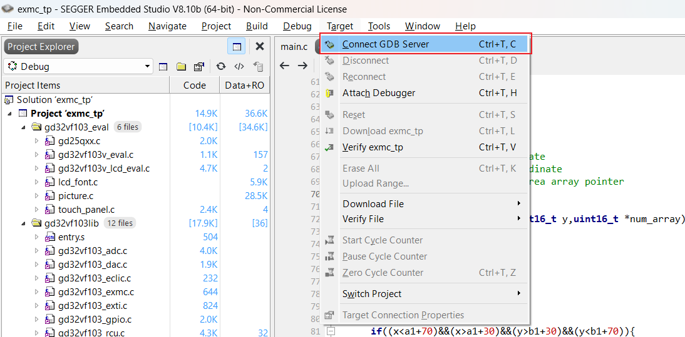

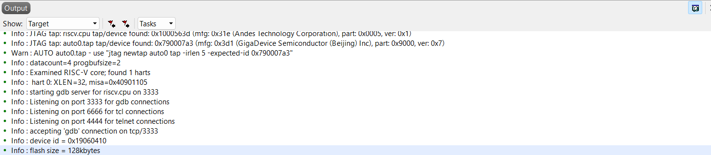


### 调试

Debug -> Go

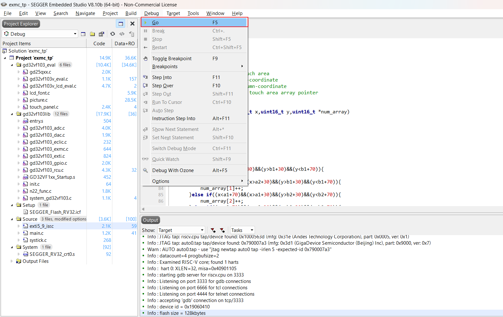

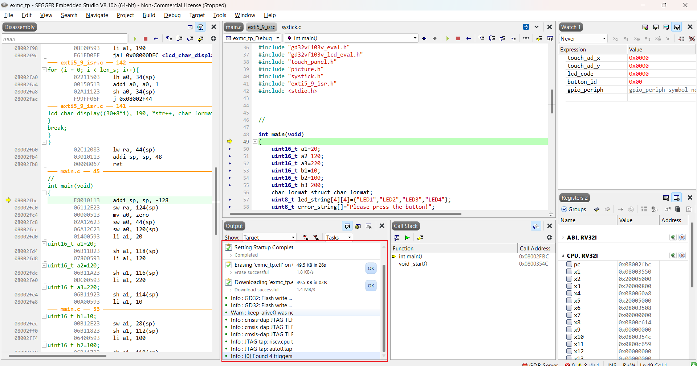


可打断点调试观察程序行为。

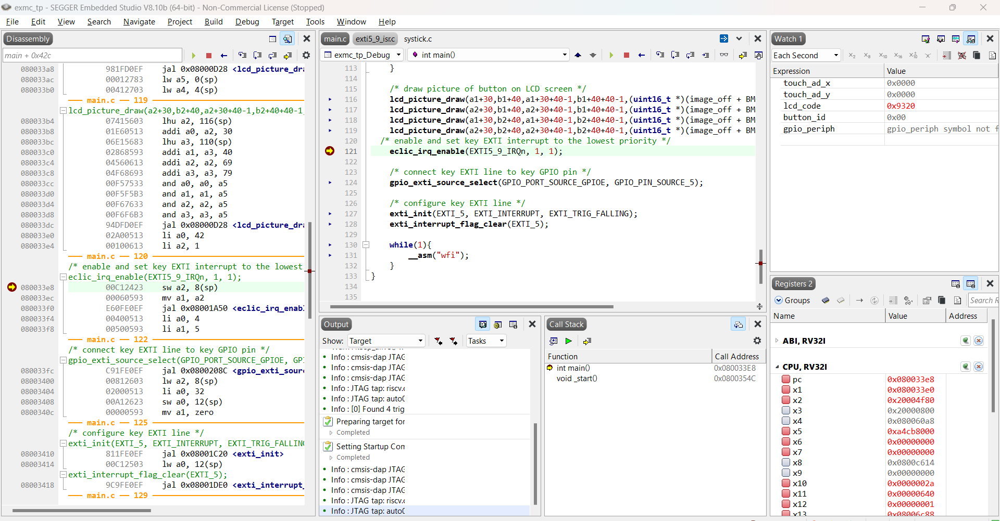

## 调试结果

触摸屏上显示程序设定的图片和文字。


### LED1

点击LED1按钮，灯LED1亮起，其它LED灯熄灭。

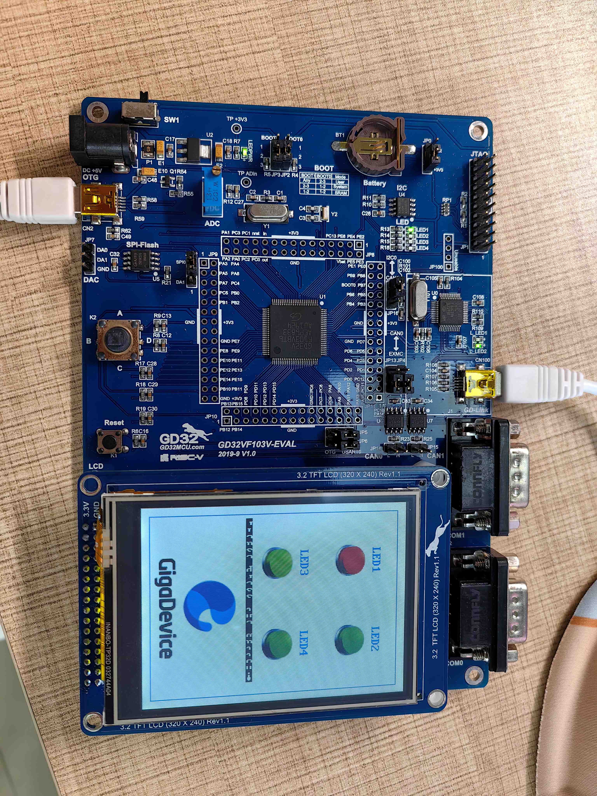

### LED2

点击LED2按钮，灯LED2亮起，其它LED灯熄灭。

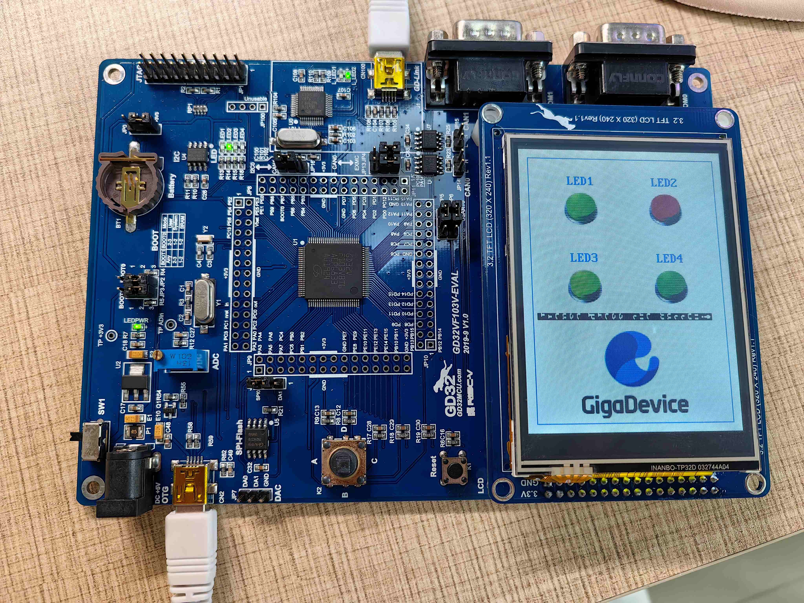


### LED3

点击LED3按钮，灯LED3亮起，其它LED灯熄灭。

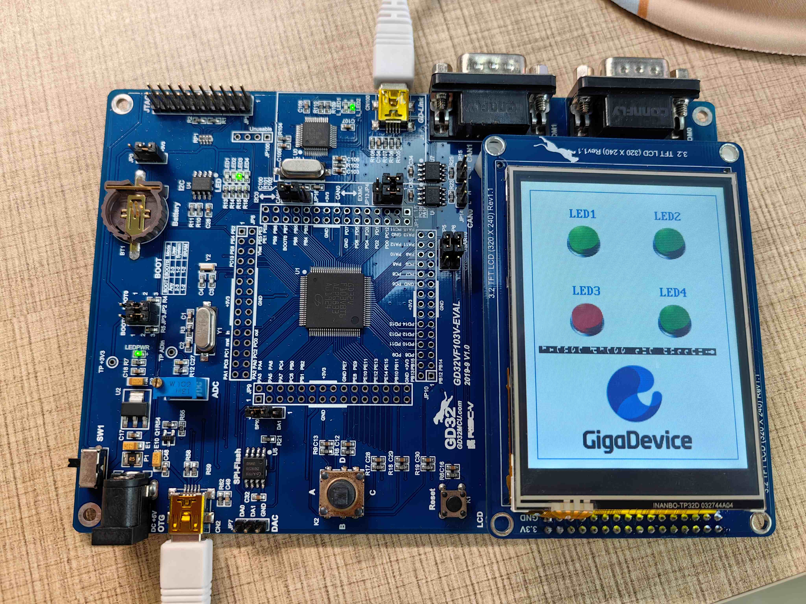


### LED4

点击LED4按钮，灯LED4亮起，其它LED灯熄灭。

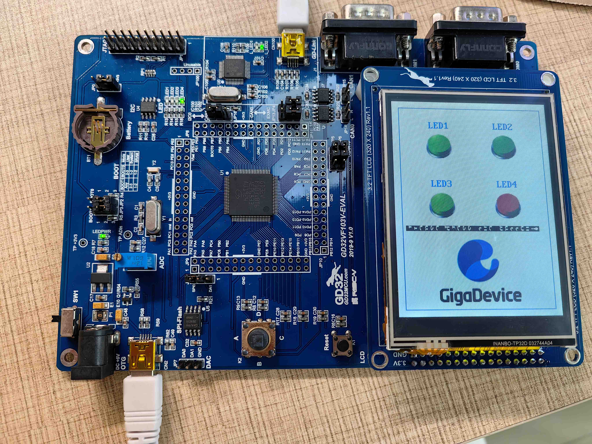


### 其它位置

点击其它位置，提示请点击按钮，这里可能由于编码问题显示文字错误，4个LED灯全亮起。

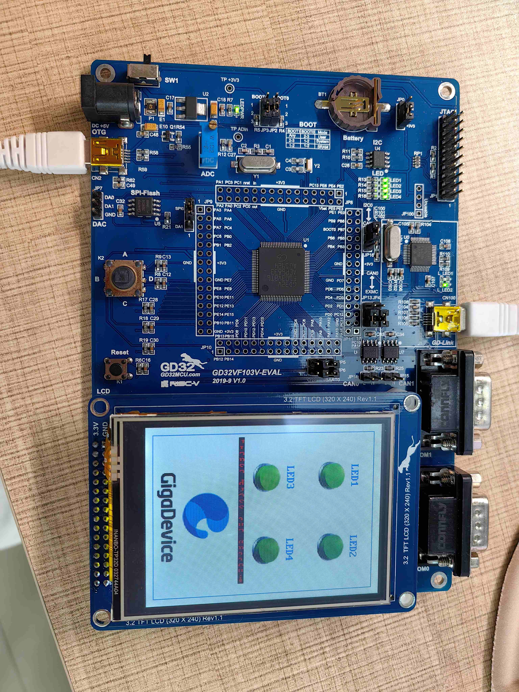


## 部分程序分析

main.c中

``` C
/* 启用并设置外部中断的优先级为最低 */
eclic_irq_enable(EXTI5_9_IRQn, 1, 1);
// eclic_irq_enable(IRQ编号, 抢占优先级, 子优先级)
// 这里启用外部中断5到9的IRQ，并将其优先级设置为1, 1

/* 将外部中断线连接到GPIO引脚 */
gpio_exti_source_select(GPIO_PORT_SOURCE_GPIOE, GPIO_PIN_SOURCE_5);
// gpio_exti_source_select(GPIO端口源, GPIO引脚源)
// 这里将EXTI外部中断线连接到端口E的引脚5

/* 配置外部中断线 */
exti_init(EXTI_5, EXTI_INTERRUPT, EXTI_TRIG_FALLING);
// exti_init(EXTI线, EXTI模式, EXTI触发方式)
// 这里初始化EXTI线5为中断模式，并设置为下降沿触发

/* 清除外部中断标志 */
exti_interrupt_flag_clear(EXTI_5);
// exti_interrupt_flag_clear(EXTI线)
// 这里清除EXTI线5的挂起中断标志，防止虚假触发

while(1){
    /* 执行等待中断指令，将微控制器置于低功耗模式 */
    __asm("wfi");
    // __asm("wfi")
    // 汇编指令“wfi”将CPU置于低功耗状态，直到发生中断
}
```


处理器待机等待中断，中断处理程序处理完毕后返回。