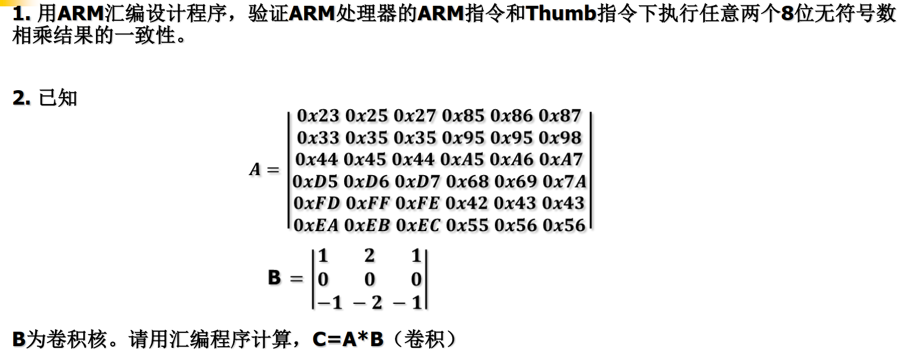

# Embedded_Microprocessor_System
2024 Spring Semester Embedded Microprocessor System Assignment  School of Software and Microelectronics, Peking University.

## HW1_“hello world”

请在keil，或segger 模拟器上调试并运行一个数值计算程序(或你以前所写的C（或C++）程序。

（1）列出编译和调试过程中遇到的问题及解决措施。

（2）提交程序源码。

## HW2_rotate

在下列三题中选择一道：

1. 导入一幅128X128的8bit灰度图像，请在ARM 处理器上编程，使图像顺时针旋转45度，并导出图像；
2. 在ARM处理器上（模拟器或实际开发板），编译并调试性能测试程序dhrystone；
3. 在ARM处理器上（模拟器或实际开发板），编译并调试性能测试程序coremark；

## HW3_conv

1. 用ARM汇编设计程序，验证ARM处理器的ARM指令和Thumb指令下执行任意两个8位无符号数相乘结果的一致性。
2. A是 6X6 矩阵， B是3X3 矩阵，计算卷积 C = A * B

## HW4_macro_define

为了节省内存，避免内存中出现空洞，常采用不对齐的方式分配内存。然而，不对齐的数据，无法用指令“LDR”和“STR”正确从内存装载和写入内存。

  （1）请编写两条宏定义指令“LDRUA”和“STRUA”，能够将32位数据正确从内存装载和写入内容，而不论数据是否对齐。

  （2）请用编写程序，用实际数据验证两条自定义指令。

## HW5_SWI

编写下列函数,然后编写程序通过软中断方式调用，计算出结果：

 （1）64位带进位的加法运算（asm）；

 （2）两个32位数相乘，结果为64位的乘法运算（C 或 asm）

## HW6_ap

1. 选在一个嵌入式操作系统，实现不少于2个任务的应用演示。

2. 阅读 u-boot-2015.10\arch\arm\cpu目录下某处理器相关的start.s文件，或者其他boot文件，请说明：如果在不同处理器间移植u-boot，需要修改 start.s中的哪些语句？请在文件中标注出来。

## HW7_optimize

在ARM处理器上, 自己选程序：

（1）分别选择o0, o1, o2, o3 优化选项，比较所生成程序的大小和执行速度。

（2）选择其中一个函数，尝试分析o0和o3选项所生成的程序指令数差别。

## HW8_gpio

参考例程，用不同的按键和LED显示方式实现键盘控制LED：

（1）在仿真器上成功调试程序；

（2）将程序烧入板上，实现上电后自动执行。

## HW9_exmc_tp

二选一：

1.用中断方式实现键盘控制 LED， 分别用 A、B、C 和 D 四个按键控制 LED1、LED2、LED3 和LED4 的状态。要求：按下键后，点亮该键对应的 LED, 同时关闭其他 三个 LED。

2.用中断方式实现触摸屏控制 LED, 分别用 button1、button2、button3 和 button4 四个按键控制 LED1、LED2、LED3 和 LED4 的状态

## HW10_OpenMP

1. Sobel 常用于图像的边缘检测:

 （1）请用OpenMP加速方法计算边缘检测（边缘强度），评估采用OpenMP带来的加速比。

 （2）自选图像，要求图像像素数大于2，000，000。

## HW11_CUDA

1. 用 GPU 实现 Sobel 算子，并用于提取图像边缘，并与OpenMP比较计算时间。
