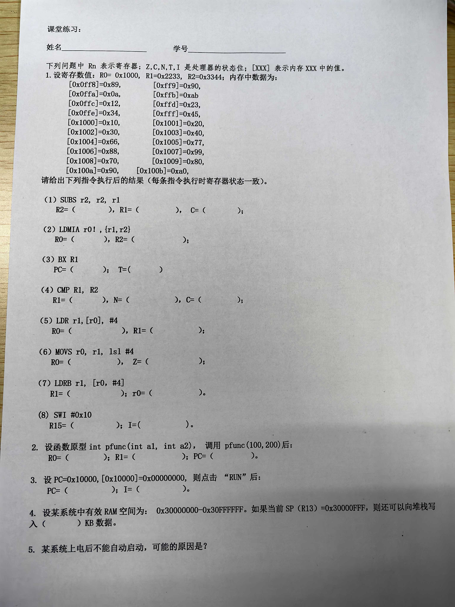

## quize

answer

### 1. 寄存器和内存的初始状态

- 寄存器：R0=0x1000, R1=0x2233, R2=0x3344
- 内存：
  - [0x0ff8]=0x89
  - [0xff9]=0x90
  - [0x0ffa]=0x0a
  - [0xffb]=0xab
  - [0x0ffc]=0x12
  - [0xffd]=0x23
  - [0x0ffe]=0x34
  - [0xfff]=0x45
  - [0x1000]=0x10
  - [0x1001]=0x20
  - [0x1002]=0x30
  - [0x1003]=0x40
  - [0x1004]=0x66
  - [0x1005]=0x77
  - [0x1006]=0x88
  - [0x1007]=0x99
  - [0x1008]=0x70
  - [0x1009]=0x80
  - [0x100a]=0x90
  - [0x100b]=0xa0

### 2. 指令执行后的结果

#### (1) SUBS r2, r2, r1

S表示可能改变处理器状态

C标志位：减法结果大于0时 C = 1， 结果小于0时 C = 0 ； 加法结果溢出时 C = 1 ，不溢出时 C = 0

- **R2**: r2 - r1 0x3344 - 0x2233 = **0x1111**
- **C**: 减法，r2 - r1 > 0，C（进位标志）为**1**。

#### (2) LDMIA r0! , (r1, r2)

Increase After，先读，地址再增加，!表示读完改变r0

- **R0**: 0x1000 + 8 = **0x1008**（!表示读完改变r0）
- **R1**: 0x1000 开始，load 4字节 0x40302010
- **R2**: 0x1004 开始，load 4字节 **0x99887766**

#### (3) BX R1

- **PC**: 取R1的值，pc双字节对齐，最低位的1表示状态切换，跳转地址舍去，所以PC = **0x2232**
- **T**: BX指令会根据R1的最低位来设置T标志，由于R1是0x2233，最低位为1，所以T=**1**。

#### (4) CMP R1, R2

- **R1**: **0x2233**（不变，因为CMP指令不修改寄存器）
- **N**: R1（0x2233）小于R2（0x3344），R1 - R2 < 0，所以N（负标志）为**1**。
- **C**: R1小于R2，R1 - R2 < 0，C（进位标志）为**0**。

#### (5) LDR r1, [r0], #4

R0更新，先读数据后更新

- **R0**: 0x1000 + #4 = **0x1004**（LDR指令会把立即数添加到R0）
- **R1**: 0x1000开始, load 4字节 = **0x40302010**

#### (6) MOVS r0, r1, ls1 #4

S表示可能改变处理器状态

- **R0**: MOVS指令会将R1的值逻辑左移4位，然后更新条件标志。R1为0x2233，左移4位得到**0x22330**。
- **Z**: 如果结果为0，则Z（零标志）为1，否则为0。这里结果不为0，所以Z=**0**。

#### (7) LDRB r1, [r0, #4]

读一个字节，基地址为0x1004

- **R1**: LDRB指令会从R0指定的地址加载一个字节。R0为0x1000，所以加载的是[0x1004]的值。因此 R1 = **0x66**
- **R0**: **0x1000**（不变，因为LDRB指令不更新R0）

#### (8) SWI #0x10

- **I**: = **1**。
- **R15** (pc): 中断向量表对应的软中断位置， **0x08**。

### 3. 函数调用

#### 设函数原型 int pfunc(int a1， int a2)，调用 pfunc(100, 200)后：

- R0通常用于存储函数的第一个参数，R1用于存储第二个参数。
- 因此，R0=100, R1=200
- pfunc

### 4. PC的初始值和点击“RUN”后的行为

#### 设 PC=0x10000,[0x10000]=0x00000000，则点击“RUN”后：

- 0x00000000为不支持的指令，因此pc会跳转到中断向量表的对应位置，PC = 0x08

### 5. 堆栈空间计算

#### 设某系统中有效RAM空间为：0x30000000-0x30FFFFFF。如果当前 SP（R13）=0x30000FFF，则还可以向堆栈写入（ ）KB 数据。

- 堆栈是向下增长的，所以从SP到RAM的结束地址之间的空间即为可使用的堆栈空间。
- 可使用的堆栈空间 = 0x30000000 - SP
- SP=0x30000FFF
- 可使用的堆栈空间 = 0x30000000 - 0x30000FFF = 0xFFF (4095字节) = 4KB

### 6. 系统上电后不能自动启动的可能原因

这个问题的答案可能依赖于具体的硬件和软件配置，但一些常见的原因可能包括：

- 电源问题
- BIOS/UEFI设置问题
- 硬件故障（如内存、CPU、硬盘等）
- 系统文件损坏或丢失
- 启动顺序配置错误

## 中断向量表

| **向量地址** | **异常中断类型**           | **异常中断模式**       | **优先级** |
| ------------ | -------------------------- | ---------------------- | ---------- |
| **0x0**      | **Reset**                  | **特权（SVC)**         | **1**      |
| **0x4**      | **Undefined  Instruction** | **未定义指令中止模式** | **6**      |
| **0x08**     | **SWI**                    | **特权模式**           | **6**      |
| **0x0c**     | **Prefetch  Abort**        | **中止模式**           | **5**      |
| **0x10**     | **Data  Abort**            | **中止模式**           | **2**      |
| **0x14**     | **Reserved**               | **未使用**             | **未使用** |
| **0x18**     | **IRQ**                    | **IRQ模式**            | **4**      |
| **0x1c**     | **FIQ**                    | **FIQ模式**            | **3**      |

•**异常事件与异常处理程序之间的对应关系；**

•**向量表大小32个字节，每个异常向量占据4个字节；**

•**每个字存放PC赋值的语句，或跳转指令；**

•**通常存放在存储器地址的低端**